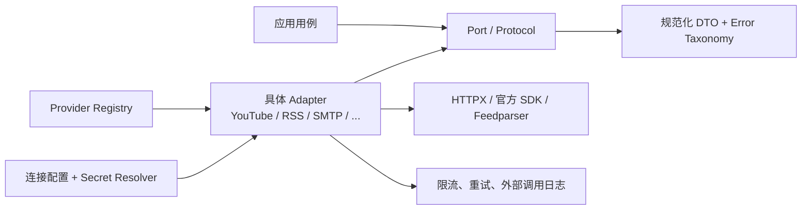

# Adapter 与 Provider 设计

文档状态：Prompt 01 接口基线；Prompt 04 平台 Adapter 已落地  
更新日期：2026-07-25

## 1. 目标与边界

Adapter/Provider 层把第三方协议映射为系统应用端口。领域服务只理解规范化 DTO、能力声明和统一错误，不理解 YouTube、RSS、OpenAI 或飞书的请求细节。

四类扩展点：

- `PlatformAdapter`：平台账号、作品和指标采集。
- `NewsProvider`：新闻条目发现、正文/更新获取。
- `LLMProvider`：结构化或文本模型调用、用量与成本元数据。
- `NotificationProvider`：向一个已配置渠道发送消息。

前端永远不调用这些接口，也不接收 Provider 凭证。它只调用 FastAPI。

## 2. 分层与依赖



端口定义在 Context 的 `application/ports`；具体实现位于 `infrastructure/providers`。注册表在 API/Worker 组合根创建，领域层不依赖注册表。

## 3. 通用契约

### 3.1 Provider 描述与能力

```python
@dataclass(frozen=True)
class ProviderDescriptor:
    key: str                    # 稳定小写键，如 youtube
    display_name: str
    contract_version: int
    source_kinds: frozenset[SourceKind]
    capabilities: Mapping[str, Capability]

@dataclass(frozen=True)
class Capability:
    supported: bool
    mode: Literal["reported", "derived", "unavailable"]
    notes: str | None = None
```

能力声明用于 UI 和应用校验，但 Provider 实际响应仍需逐字段标记可用性。新增 Provider 通过注册，不通过业务服务中的平台名分支。

### 3.2 调用上下文

```python
@dataclass(frozen=True)
class ProviderCallContext:
    workspace_id: UUID
    connection_id: UUID
    trace_id: UUID
    deadline: datetime
    source_kind: SourceKind
```

Adapter 从 `SecretResolver` 按 Connection 获取去密配置。调用上下文不包含可序列化到任务消息的明文秘密。

### 3.3 来源元数据

每个返回对象包含：

```python
@dataclass(frozen=True)
class Provenance:
    source_kind: Literal["live", "imported", "mock"]
    provider: str
    external_id: str | None
    fetched_at: datetime
    source_url: str | None
    raw_payload_ref: str | None
    provider_schema_version: str | None
```

`mock` 来源由 Mock Adapter 固定赋值，调用方不能覆盖成 `live`。

### 3.4 分页、限流与结果

```python
@dataclass(frozen=True)
class Page[T]:
    items: tuple[T, ...]
    next_cursor: str | None
    checkpoint: Mapping[str, Any]
    rate_limit: RateLimitObservation | None
```

Cursor 是 Provider 不透明值，只在对应 Connection/操作中使用并加密或安全存储。`checkpoint` 用于安全恢复，不能包含 Token。

### 3.5 错误分类

| 错误 | 是否自动重试 | 处理 |
| --- | --- | --- |
| `AuthenticationError` | 否 | 标记连接需要处理，审计但不记录秘密 |
| `PermissionDeniedError` | 否 | 记录缺失 scope/资源权限 |
| `NotFoundError` | 否 | 标记远端对象缺失，不自动删除本地历史 |
| `ValidationError` | 否 | Provider 映射或用户配置错误 |
| `RateLimitError` | 是 | 遵循 `retry_after/reset_at`，不盲目指数重试 |
| `TransientProviderError` | 是 | 有上限的指数退避 + jitter |
| `ProviderUnavailableError` | 是 | 熔断/延迟，隔离该 Provider |
| `PermanentProviderError` | 否 | 记录安全响应摘要，人工处理 |
| `ContractMappingError` | 否 | 隔离原始响应、告警并进入契约修复 |

HTTP 状态不能直接等于业务分类；具体 Adapter 负责映射。所有外部调用设置连接、读取和总 deadline。

## 4. PlatformAdapter

### 4.1 应用端口

```python
class PlatformAdapter(Protocol):
    descriptor: ProviderDescriptor

    async def verify_connection(
        self, ctx: ProviderCallContext
    ) -> ConnectionVerification: ...

    async def resolve_account(
        self, ctx: ProviderCallContext, locator: AccountLocator
    ) -> PlatformAccountDTO: ...

    async def fetch_account(
        self, ctx: ProviderCallContext, external_account_id: str
    ) -> PlatformAccountDTO: ...

    async def fetch_account_metrics(
        self, ctx: ProviderCallContext, external_account_id: str
    ) -> AccountMetricsDTO: ...

    async def list_media(
        self,
        ctx: ProviderCallContext,
        external_account_id: str,
        *,
        published_after: datetime | None,
        cursor: str | None,
        page_size: int,
    ) -> Page[MediaItemDTO]: ...

    async def fetch_media_metrics(
        self, ctx: ProviderCallContext, external_media_ids: Sequence[str]
    ) -> tuple[MediaMetricsDTO, ...]: ...
```

不要求所有平台实现相同批量能力；Descriptor 声明最大批量、指标和历史回溯能力。应用用例根据能力选择安全调用方式，但不按 Provider 名称判断。

### 4.2 DTO 规则

- 计数缺失为 `None`，不转换成 0。
- 每个指标携带 `quality=reported|derived` 和原始字段名。
- `observed_at` 优先使用 Provider 给出的统计时间；没有时用本次观察时间并标来源。
- Provider 扩展放入有 schema 版本的 `extensions`，不得含秘密或未经评估的大对象。
- Adapter 不返回 SQLAlchemy 实体，也不自行提交数据库事务。

### 4.3 YouTube Adapter 首期映射

只使用 Google/YouTube 官方 API 和用户提供的合法凭证。频道、视频和统计字段映射需使用录制的去敏响应 fixture 做契约测试；配额成本按端点记录。YouTube 不提供的分享、收藏或完播等字段返回不可用能力，不猜测数值。

### 4.4 Mock Adapter

- Provider key 固定包含 `mock`，Descriptor 只允许 `source_kind=mock`。
- 数据由确定性 seed/fixture 产生，便于测试重放。
- 返回 URL、名称和 UI 标签均标明“模拟数据”。
- 不复用 YouTube 品牌、外部 ID 或声称来自真实 API。
- Mock 契约通过不等于真实 YouTube 集成通过；报告分别列出。

## 5. NewsProvider

> Prompt 05 实现说明：`apps/api/app/providers/news/` 已提供 RSS、Atom、Generic JSON 和 Manual Provider，共享 URL 规范化、错误分类、超时与有限重试；配置由 Provider Registry 注入，前端不直连来源。详见 `docs/NEWS_AGGREGATION.md`。

> Prompt 04 实现说明：平台协议代码位于 `apps/api/app/adapters/platforms/`；YouTube Data API、确定性 Mock、三个显式失败骨架和 Provider Registry 已通过契约测试。实际方法名按 Prompt 04 要求包含 `validate_config`、`list_contents`、`fetch_*_analytics` 与 `health_check`，语义保持本设计边界。同步运行与真实性说明见 `docs/PLATFORM_SYNC.md`。

### 5.1 应用端口

```python
class NewsProvider(Protocol):
    descriptor: ProviderDescriptor

    async def verify_source(
        self, ctx: ProviderCallContext, source: NewsSourceConfig
    ) -> SourceVerification: ...

    async def fetch_entries(
        self,
        ctx: ProviderCallContext,
        source: NewsSourceConfig,
        *,
        since: datetime | None,
        cursor: str | None,
        limit: int,
    ) -> Page[NewsEntryDTO]: ...

    async def fetch_document(
        self, ctx: ProviderCallContext, entry: NewsEntryDTO
    ) -> NewsDocumentDTO | None: ...
```

`fetch_document` 是可选能力。RSS 首期优先使用 Feed 内合法提供的正文/摘要与原链接；不默认抓取目标网页全文。若后续抓取公开网页，必须遵守来源许可、robots/条款和限流。

### 5.2 标准化与去重边界

- Provider 负责解析协议和生成规范化 DTO。
- News 应用服务负责规范化 URL、内容指纹、修订与候选去重。
- 聚类和评分属于 News 领域服务，不进入 RSS Provider。
- RSS `published` 缺失时保持 null；`fetched_at` 不可冒充发布时间。
- 发现相同 URL 的新内容哈希时创建 Revision，而非覆盖旧正文。

## 6. LLMProvider

详细工作流见 `docs/PROMPT_ENGINE_DESIGN.md`。最小端口：

```python
class LLMProvider(Protocol):
    descriptor: ProviderDescriptor

    async def list_models(
        self, ctx: ProviderCallContext
    ) -> tuple[ModelCapability, ...]: ...

    async def generate(
        self, ctx: ProviderCallContext, request: LLMRequest
    ) -> LLMResponse: ...

    async def stream(
        self, ctx: ProviderCallContext, request: LLMRequest
    ) -> AsyncIterator[LLMChunk]: ...
```

`LLMRequest` 包含系统/用户消息、模型 ID、参数、deadline、结构化输出 schema 和幂等元数据；不包含数据库实体。`LLMResponse` 包含文本/结构化输出、Provider request ID、finish reason、reported usage、model revision 和安全元数据。

首期工作流以非流式、可恢复调用为主；流式只改善 UI，不作为持久化成功判定。OpenAI 兼容接口配置必须限制允许的 base URL，防止 SSRF。

## 7. NotificationProvider

详细投递设计见 `docs/NOTIFICATION_DESIGN.md`。最小端口：

```python
class NotificationProvider(Protocol):
    descriptor: ProviderDescriptor

    async def verify_channel(
        self, ctx: ProviderCallContext, config: ChannelConfig
    ) -> ChannelVerification: ...

    async def send(
        self,
        ctx: ProviderCallContext,
        destination: Destination,
        message: RenderedNotification,
        idempotency_key: str,
    ) -> DeliveryReceipt: ...
```

Provider 只负责传输和错误映射，不决定规则是否命中、如何构造业务文案或是否处于冷却期。

## 8. 注册与发现

```python
class ProviderRegistry(Generic[P]):
    def register(self, provider: P) -> None: ...
    def get(self, key: str) -> P: ...
    def descriptors(self) -> tuple[ProviderDescriptor, ...]: ...
```

- 每种端口拥有独立 Registry，避免同名 Provider 类型冲突。
- 组合根显式注册首期实现；未注册 key 返回可诊断错误，不动态导入任意用户代码。
- 后续插件通过受信任 entry point/manifest 加载，并校验契约版本；插件权限和进程隔离在有需求时增强。
- 用户自定义 OpenAI 兼容接口和 Webhook 是“配置型 Provider”，不等于运行任意插件代码。

## 9. 可靠性与限流

- 重试分两层：HTTP 客户端只重试安全的连接级失败；Celery 用例按业务错误分类重试。禁止两层无限叠加。
- 默认最大 3 次业务尝试；Provider 可根据配额返回更晚时间。
- 每个 Connection + operation 有 Redis token bucket；数据库记录最新限流观察用于恢复。
- 写外部副作用（通知）必须传幂等键；第三方不支持时由本地唯一约束防止再次主动发送，并把不确定结果标为 `unknown` 等待人工/查询确认。
- Circuit breaker 只隔离具体 Provider/Connection，不阻塞其他源。

## 10. 测试策略

每个具体实现必须具备：

- 通用端口契约测试：分页、null、来源、错误分类、deadline、能力声明。
- 去敏录制 fixture 或官方示例响应映射测试；fixture 标明不是实时数据。
- 429、401、403、404、5xx、超时、无效 JSON、字段新增/缺失测试。
- Mock 与真实 Adapter 来源不可混淆测试。
- Registry 重复 key、未知 key 和契约版本测试。
- 少量需要真实凭证的 smoke test 默认跳过并明确报告，不能由 Mock 结果替代。

## 11. 版本兼容

- `contract_version` 表示本系统端口版本；Provider API 版本单独记录。
- DTO 新增可选字段可向后兼容；删除/改语义需提升契约版本。
- 原始 payload 引用允许在映射修复后重放，但重放生成新快照/修订并标明处理版本，不能改写历史。
