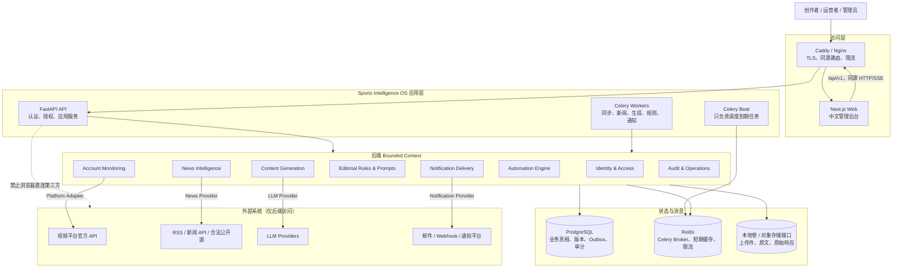
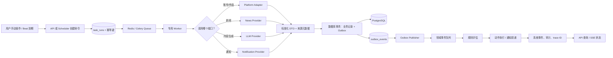
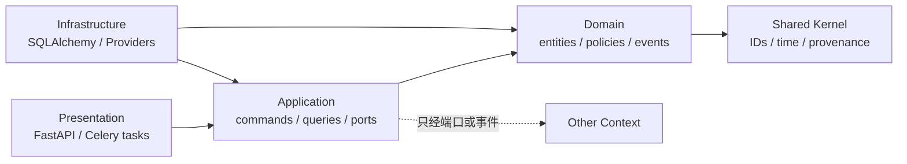

# Sports Intelligence OS 系统架构

文档状态：Prompt 01 架构基线  
更新日期：2026-07-25

## 1. 架构结论

首期采用**模块化单体**，通过同一后端代码包启动 API、Celery Worker 和 Celery Beat 三类进程。各 Bounded Context 具有独立应用服务、领域模型和基础设施适配层，不允许跨上下文直接操作对方数据表。

选择模块化单体的原因：

- 首期团队和部署规模不需要微服务的网络、发布和数据一致性成本；
- PostgreSQL 事务可以同时保证业务写入与 Outbox 事件一致性；
- API 和后台任务仍是独立进程，慢外部调用不会阻塞 Web 请求；
- Provider 契约、队列和 Outbox 已形成未来拆分边界。

这不是“所有代码放在一个 service.py”。模块边界通过包依赖、应用端口和契约测试强制执行。

## 2. 系统架构图



图中的虚线表示禁止关系：浏览器只调用本系统 API，不获得第三方秘密，也不直接调用平台、LLM 或通知接口。

## 3. Bounded Context 与职责

| Context | 负责 | 不负责 | 主要输出事件 |
| --- | --- | --- | --- |
| Identity & Access | 用户、工作区、成员、角色、会话、集成秘密引用 | 平台业务数据 | `member.changed`、`integration.updated` |
| Account Monitoring | 平台账号、作品、快照、指标、同步计划与运行 | 第三方认证 UI、新闻 | `account.snapshot.recorded`、`media.snapshot.recorded` |
| News Intelligence | 新闻源、文章、修订、去重、事件聚类、评分 | Prompt 或脚本生成 | `news.article.ingested`、`news.event.updated` |
| Editorial Knowledge | 7.9 原文、结构化编辑规则、Prompt 模板及版本 | LLM 调用和自动化条件 | `rule_set.published`、`prompt_version.published` |
| Content Generation | 输入快照、工作流运行、阶段产物、审查、用量 | Prompt 编辑、通知传输 | `generation.completed`、`generation.failed` |
| Automation Engine | 领域事件、条件树、评估状态、动作编排、冷却去重 | 渠道协议细节 | `automation.matched`、`action.requested` |
| Notification Delivery | 渠道配置、模板渲染、投递尝试、Provider 调用 | 决定何时通知 | `notification.delivered`、`notification.failed` |
| Audit & Operations | 系统事件、任务运行、审计、健康与可观察性 | 修改业务事实 | 运维指标与告警 |

上下文之间只通过应用端口或版本化领域事件协作。共享 Kernel 仅包含 ID、UTC 时间、分页、错误、来源元数据和事件信封，不包含平台或领域业务逻辑。

## 4. 核心数据流程图



关键保证：

- API 请求不等待长时间外部调用；接受命令后返回 `202 Accepted` 和运行资源地址。
- 业务数据与 Outbox 在同一 PostgreSQL 事务中提交，避免“数据成功但事件丢失”。
- Celery 是至少一次投递；每个消费者以 `idempotency_key`、业务唯一键和状态机实现幂等。
- 外部原始响应不直接成为领域模型；先经 Adapter/Provider 标准化、校验并附来源元数据。

## 5. 运行时组件

### 5.1 Web

Next.js App Router 负责页面、路由布局和服务端初始会话判断；TanStack Query 管理 API 服务器状态；TanStack Table 处理列表；React Hook Form + Zod 处理前端表单。前端不保存第三方 Token，不直连外部平台。

### 5.2 API

FastAPI 负责：

- 会话认证、CSRF 和工作区权限检查；
- 请求校验、应用命令与查询；
- 创建异步运行并返回状态资源；
- OpenAPI、健康检查和可选 SSE 状态流；
- 统一错误、分页、幂等和 trace ID。

API 不执行大批量同步、网页抓取、长时间 LLM 调用或通知重试。

### 5.3 Worker 与 Beat

Worker 按资源隔离队列：`sync.platform`、`ingest.news`、`generation`、`automation`、`notification`、`maintenance`。首期可在一个容器启动多个队列消费者，但代码、并发和重试策略独立。

Beat 只读取计划并投递任务，不执行业务。动态计划以数据库为真相源；Beat 可用固定频率扫描到期计划，避免每次配置变化都重启调度器。

### 5.4 PostgreSQL、Redis 与文件存储

- PostgreSQL：唯一业务真相源、历史快照、版本、任务、Outbox、审计。
- Redis：Celery Broker、短期结果/缓存、分布式限流和短锁；不可作为唯一业务状态。
- 文件存储端口：开发环境使用受控本地卷；生产可换 S3 兼容对象存储。数据库只保存对象键、哈希、MIME、大小和来源。

## 6. 目标项目目录

Prompt 02 已按以下目录初始化。API 与 Worker 是独立进程入口，但共享后端应用包和领域边界：

```text
Sports Intelligence OS/
├── AGENTS.md
├── README.md
├── apps/
│   ├── web/                         # Next.js，不含第三方平台密钥
│   │   ├── app/
│   │   └── lib/                     # 本系统 API/认证客户端
│   ├── api/
│   │   ├── pyproject.toml
│   │   ├── alembic/
│   │   ├── app/                     # FastAPI、共享模型/服务、Celery 任务
│   │   │   ├── api/
│   │   │   ├── core/
│   │   │   ├── db/
│   │   │   ├── models/
│   │   │   ├── schemas/
│   │   │   ├── services/
│   │   │   ├── adapters/
│   │   │   ├── providers/
│   │   │   ├── repositories/
│   │   │   ├── rules/
│   │   │   ├── prompts/
│   │   │   ├── workflows/
│   │   │   └── tasks/
│   │   └── tests/
│   └── worker/                      # 独立 Celery 组合根
├── packages/
│   ├── shared-types/                # 前端共享 API 类型
│   ├── ui/                          # 可复用 UI 基元
│   └── config/                      # TypeScript 配置
├── deploy/                          # Dockerfile 与 Caddy 配置
├── scripts/                         # 本地开发和静态验证脚本
├── tests/
│   ├── test_project_context.py
│   └── test_infrastructure_contract.py
├── docker-compose.yml
├── Makefile
├── .env.example
└── docs/
    ├── adr/
    └── *.md
```

业务 Context 从 Prompt 03 起按下列依赖方向逐步落入上述目录；小功能可以先合并文件：

```text
context_name/
├── domain/          # 实体、值对象、领域服务、领域事件；无框架依赖
├── application/     # 命令、查询、用例、端口
├── infrastructure/  # SQLAlchemy 仓储、外部 Adapter/Provider
└── presentation/    # FastAPI 路由和任务入口的薄适配层
```

允许同一 Context 的小功能先合并文件，但禁止跳过依赖方向：`presentation/infrastructure → application → domain`。

## 7. 模块依赖规则



强制规则：

- Domain 不导入 FastAPI、Celery、SQLAlchemy、HTTPX 或具体 Provider SDK。
- 路由不直接访问 ORM Session；只调用应用命令/查询。
- Celery 任务只解析任务载荷、建立 trace、调用应用用例并映射重试策略。
- Context A 不导入 Context B 的 ORM 模型或仓储。
- 外部平台标识只存在于适配器注册和连接配置，不在核心用例中形成大段 `if platform == ...`。

## 8. 数据与一致性策略

### 8.1 事务

单个 Context 的命令使用一个数据库事务。跨 Context 不做分布式事务，采用 Outbox + 幂等消费者和可补偿状态机。

### 8.2 标识与时间

- 内部主键使用 UUIDv7（若库支持）或 UUID；第三方 ID 单独存储，不用作主键。
- 时间以有时区的 UTC `timestamptz` 存储；API 输出 ISO 8601；UI 按用户时区显示。
- 金额使用定点数和 ISO 4217 币种；Token 用整数；比率保存高精度 decimal。

### 8.3 原始数据

原始响应用于审计和重新映射，通过对象存储引用或受控 JSONB 保存；不能让原始 JSON 取代规范化列。秘密和不必要的个人数据在落盘前移除。

## 9. 部署拓扑

首期 Docker Compose 服务：

| 服务 | 进程 | 可横向扩展 | 持久状态 |
| --- | --- | --- | --- |
| `proxy` | Caddy/Nginx | 后续 | 无 |
| `web` | Next.js | 是 | 无 |
| `api` | FastAPI/Uvicorn | 是 | 无 |
| `worker` | Celery Workers | 按队列 | 无 |
| `beat` | Celery Beat | 单活 | 调度状态在数据库 |
| `postgres` | PostgreSQL | 首期单实例 | 命名卷 |
| `redis` | Redis | 首期单实例 | 可恢复的队列状态 |

生产部署要求 TLS、非默认密码、只暴露 Proxy、健康检查、资源限制、备份和日志轮转。数据库与 Redis 不直接暴露公网端口。

## 10. 可观察性

- 每个入口生成或接收 `trace_id`；异步事件保留 `causation_id` 和 `correlation_id`。
- 结构化 JSON 日志字段：时间、级别、服务、环境、trace、workspace、actor、event、resource、provider、attempt、duration、error_code。
- 禁止记录密码、Cookie、Authorization、Provider Token、完整 Prompt 中的敏感上传内容。
- 核心指标：API 延迟/错误率、队列深度、任务延迟、Provider 限流/失败、同步新鲜度、生成耗时/Token/成本、规则匹配数、通知成功率。
- 首期日志输出到 stdout 并由容器收集；不提前引入独立日志集群。

## 11. 关键架构决策

| 决策 | 选择 | 原因 | 复核触发条件 |
| --- | --- | --- | --- |
| 服务形态 | 模块化单体，多进程部署 | 降低首期复杂度，保留清晰拆分边界 | Context 独立扩容/发布成为持续瓶颈 |
| API | REST `/api/v1` + 轮询；必要处 SSE | OpenAPI 友好，适合 CRUD 与长任务状态 | 大量双向实时交互出现 |
| 异步 | Celery + Redis + DB 任务记录 | 与指定栈一致，运维可控 | 消息吞吐或多租户隔离超出能力 |
| 事件可靠性 | PostgreSQL Transactional Outbox | 无需 Kafka 即可避免事件丢失 | Outbox 成为经验证吞吐瓶颈 |
| 数据库 | PostgreSQL 单一业务真相源 | 事务、JSONB、索引和生态满足首期 | 时序/搜索负载有实际证据 |
| 租户隔离 | `workspace_id` + 应用授权；关键表预留 RLS | 首期简单且可测试 | 企业合规要求数据库强隔离 |
| 文件 | Storage Port，本地卷起步 | 可迁移至 S3，不把大文件塞入数据库 | 多节点部署或容量增长 |
| Provider 扩展 | 显式注册表 + 能力声明 | 避免平台分支和错误能力假设 | 插件需要进程级隔离 |

正式 ADR 在 Prompt 02 起保存在 `docs/adr/`，本表是 Prompt 01 的决策基线。

## 12. 架构质量门

后续实现必须通过以下审查：

- 新平台是否只新增 Adapter、映射和注册，而非修改多个业务服务？
- 新通知渠道是否不修改规则评估器？
- 新 LLM 是否不修改工作流状态机和 Prompt 数据模型？
- 任何前端请求是否都只到本系统 API？
- 新数据表是否具有单一明确职责，而非万能实体/万能 JSON？
- 任何外部记录是否携带 `source_kind` 和 Provider 来源？
- 任何异步副作用是否有幂等键、重试上限和审计状态？
