# Sports Intelligence OS 数据库设计

文档状态：Prompt 01 逻辑设计，具体 SQL 由 Prompt 02–08 的 Alembic 迁移实现  
数据库：PostgreSQL

## 1. 设计原则

- PostgreSQL 是业务真相源；Redis 不保存不可恢复的唯一业务状态。
- 所有工作区业务表包含 `workspace_id`，仓储查询必须显式限定工作区。
- 使用规范化核心列保证查询、约束与索引；JSONB 仅保存 Provider 扩展、版本化 schema 数据或安全摘要。
- 账号快照、作品快照、新闻评分、规则版本、Prompt 版本、生成步骤和投递尝试分别建表，不建“entity_type + arbitrary_json”万能表。
- 外部 ID 与内部 UUID 分开；软删除只用于需要恢复/审计的配置对象，历史/审计表追加写。
- 所有时间使用 `timestamptz` UTC；所有表使用明确的 `created_at`，可变表另有 `updated_at`。
- 发布版本不可变；数据库触发器或服务层防止更新，测试验证。

## 2. 命名和通用类型

- 表与列使用 `snake_case`；主键统一 `id uuid`。
- 枚举优先使用受 CHECK 约束的短字符串，便于非破坏扩展；高稳定枚举可使用 PostgreSQL enum。
- 密钥与会话只保存加密密文或不可逆哈希；搜索用规范化哈希/指纹。
- 计数使用 `bigint`；时长使用毫秒 `bigint`；比率 `numeric(12,8)`；成本 `numeric(20,8)` + `currency char(3)`。
- 乐观锁配置 `row_version integer`；API ETag 可由版本和更新时间生成。

## 3. 核心实体关系图

为保持可读性，本图显示关键实体；各 Context 的辅助表在后续章节列出。

```mermaid
erDiagram
    USERS ||--o{ WORKSPACE_MEMBERSHIPS : joins
    WORKSPACES ||--o{ WORKSPACE_MEMBERSHIPS : contains
    WORKSPACES ||--o{ INTEGRATION_CONNECTIONS : owns
    USERS ||--o{ SESSIONS : authenticates

    WORKSPACES ||--o{ PLATFORM_ACCOUNTS : owns
    INTEGRATION_CONNECTIONS ||--o{ PLATFORM_ACCOUNTS : authorizes
    PLATFORM_ACCOUNTS ||--o{ MEDIA_ITEMS : publishes
    PLATFORM_ACCOUNTS ||--o{ ACCOUNT_SNAPSHOTS : observed_as
    MEDIA_ITEMS ||--o{ MEDIA_SNAPSHOTS : observed_as
    PLATFORM_ACCOUNTS ||--o{ SYNC_RUNS : synchronized_by

    WORKSPACES ||--o{ NEWS_SOURCES : owns
    NEWS_SOURCES ||--o{ NEWS_ARTICLES : publishes
    NEWS_ARTICLES ||--o{ ARTICLE_REVISIONS : revised_as
    NEWS_EVENTS ||--o{ EVENT_ARTICLE_LINKS : groups
    NEWS_ARTICLES ||--o{ EVENT_ARTICLE_LINKS : linked_to
    NEWS_EVENTS ||--o{ NEWS_SCORE_SNAPSHOTS : scored_as

    WORKSPACES ||--o{ RULE_SETS : owns
    RULE_SETS ||--o{ RULE_SET_VERSIONS : versions
    RULE_SET_VERSIONS ||--o{ RULE_NODES : structures
    RULE_NODES ||--o{ RULE_EXAMPLES : illustrates
    RULE_NODES ||--o{ RULE_RELATIONS : relates
    RULE_SET_VERSIONS }o--|| SOURCE_ARTIFACTS : traces_to

    WORKSPACES ||--o{ PROMPT_TEMPLATES : owns
    PROMPT_TEMPLATES ||--o{ PROMPT_VERSIONS : versions
    WORKSPACES ||--o{ WORKFLOW_DEFINITIONS : owns
    WORKFLOW_DEFINITIONS ||--o{ WORKFLOW_VERSIONS : versions

    WORKSPACES ||--o{ GENERATION_RUNS : owns
    GENERATION_RUNS ||--o{ GENERATION_INPUTS : freezes
    GENERATION_RUNS ||--o{ GENERATION_STEPS : executes
    GENERATION_STEPS ||--o{ GENERATION_ARTIFACTS : produces
    GENERATION_STEPS ||--o{ MODEL_USAGE_RECORDS : consumes

    WORKSPACES ||--o{ AUTOMATION_RULES : owns
    AUTOMATION_RULES ||--o{ AUTOMATION_RULE_VERSIONS : versions
    AUTOMATION_RULE_VERSIONS ||--o{ RULE_EVALUATIONS : evaluates
    RULE_EVALUATIONS ||--o{ ACTION_EXECUTIONS : requests

    WORKSPACES ||--o{ NOTIFICATION_CHANNELS : owns
    NOTIFICATION_CHANNELS ||--o{ NOTIFICATIONS : targets
    NOTIFICATIONS ||--o{ DELIVERY_ATTEMPTS : attempts

    WORKSPACES ||--o{ TASK_RUNS : tracks
    WORKSPACES ||--o{ OUTBOX_EVENTS : emits
    WORKSPACES ||--o{ SYSTEM_EVENTS : reports
    WORKSPACES ||--o{ AUDIT_ENTRIES : audits
```

## 4. Identity & Access 表

### `users`

关键列：`id`、`email_normalized`、`email_display`、`password_hash`、`display_name`、`status`、`locale`、`timezone`、`last_login_at`、时间戳。  
约束/索引：`UNIQUE(email_normalized)`；状态 CHECK；禁用用户无法创建新 Session。

### `workspaces`

关键列：`id`、`name`、`slug`、`status`、`default_timezone`、`row_version`、时间戳。  
约束：`UNIQUE(slug)`；至少一个 Owner 由事务服务保证。

### `workspace_memberships`

关键列：`workspace_id`、`user_id`、`role`、`status`、`invited_by`、`joined_at`。  
约束：`UNIQUE(workspace_id,user_id)`；角色为 `owner/admin/editor/analyst/viewer`。

### `sessions`

关键列：`id`、`user_id`、`token_hash`、`csrf_secret_hash`、`created_at`、`last_seen_at`、`expires_at`、`revoked_at`、`ip_hash`、`user_agent_summary`。  
约束/索引：`UNIQUE(token_hash)`；`INDEX(user_id, expires_at)`；定期清理过期行。

### `integration_connections`

关键列：`id`、`workspace_id`、`provider_key`、`display_name`、`source_kind`、`config_json`、`secret_ciphertext` 或 `secret_ref`、`secret_key_version`、`capabilities_json`、`verification_status`、`verified_at`、`last_error_code`、`row_version`、时间戳、`deleted_at`。  
约束：`source_kind in (live, imported, mock)`；`config_json` 不含秘密；同一连接更新使用乐观锁。

## 5. Account Monitoring 表

### `platform_accounts`

关键列：`id`、`workspace_id`、`connection_id`、`provider_key`、`external_account_id`、`handle`、`canonical_url`、`display_name`、`description`、`avatar_url`、`source_kind`、`provider_schema_version`、`provider_extra_json`、`sync_status`、`last_synced_at`、时间戳、`deleted_at`。  
约束：`UNIQUE(workspace_id, provider_key, external_account_id)`；Connection 和 Account 必须同工作区、同 Provider/source kind（服务层 + 复合外键策略）。

### `media_items`

关键列：`id`、`workspace_id`、`platform_account_id`、`provider_key`、`external_media_id`、`media_type`、`title`、`description`、`published_at`、`duration_ms`、`canonical_url`、`language`、`visibility`、`thumbnail_url`、`source_kind`、`provider_extra_json`、`last_source_observed_at`、时间戳。  
约束：`UNIQUE(platform_account_id, external_media_id)`；`duration_ms >= 0`。

### `account_snapshots`

关键列：`id`、`workspace_id`、`platform_account_id`、`sync_run_id`、`observed_at`、`fetched_at`、`followers_count`、`following_count`、`total_views_count`、`total_likes_count`、`total_media_count`、各字段质量标记、`source_kind`、`raw_payload_ref`、`payload_hash`、`created_at`。  
约束：计数非负；`UNIQUE(platform_account_id, sync_run_id, observed_at)`。  
索引：`(platform_account_id, observed_at desc)`；BRIN `observed_at` 在数据量达到阈值后启用。

### `media_snapshots`

关键列：`id`、`workspace_id`、`media_item_id`、`sync_run_id`、`observed_at`、`fetched_at`、`views_count`、`likes_count`、`comments_count`、`shares_count`、`favorites_count`、`followers_gained`、`average_watch_time_ms`、`completion_rate`、质量标记、`source_kind`、`raw_payload_ref`、`payload_hash`、`created_at`。  
约束：计数非负；比率 0–1；唯一键与账号快照同理。  
索引：`(media_item_id, observed_at desc)`、`(workspace_id, observed_at desc)`。

### 指标扩展表

- `metric_definitions`：工作区、scope（account/media）、key、名称、单位、值类型、表达式/算法版本、状态。
- `account_metric_values`：`snapshot_id`、`metric_definition_id`、numeric/text/bool 中恰好一个值、quality、explanation。
- `media_metric_values`：与上表结构相同但外键到媒体快照。
- `media_traffic_source_snapshots`：媒体快照、source_key、views/share 比例、quality。
- `media_search_keyword_snapshots`：媒体快照、keyword、views/share、rank、quality。

两个 metric value 表避免跨实体万能 EAV；核心高频指标仍为快照明确列。表达式采用受限 DSL，不保存可执行代码。

### 同步表

- `sync_schedules`：工作区、scope/subject、interval/cron、timezone、enabled、next_run_at、last_enqueued_at、row_version。
- `sync_runs`：工作区、account、trigger（manual/scheduled/retry）、状态、cursor_json、idempotency_key、started/finished、计数、错误、安全摘要。
- `provider_rate_limit_states`：connection、bucket、remaining、reset_at、observed_at；仅作协调提示，Provider 返回为准。

## 6. News Intelligence 表

### `news_sources`

关键列：`id`、`workspace_id`、`connection_id nullable`、`provider_key`、`source_type`、`name`、`feed_url`、`site_url`、`language`、`source_tier`、`source_kind`、`fetch_policy_json`、`enabled`、`last_fetched_at`、`next_fetch_at`、`row_version`、时间戳。  
约束：工作区内规范化 feed URL 唯一。

### `news_articles`

> Prompt 05 首期已落地为 `news_sources`、`articles`、`topic_events`、`event_articles`、`news_sync_runs`、`news_scoring_configs`。当前 Feed 更新同一 Article；独立 ArticleRevision、实体抽取链接与评分快照保留为后续扩展，不能宣称已实现。热度参数已独立版本表，不存入万能配置表。

关键列：`id`、`workspace_id`、`news_source_id`、`provider_external_id`、`canonical_url`、`canonical_url_hash`、`title`、`summary`、`author`、`language`、`published_at`、`first_fetched_at`、`last_fetched_at`、`event_started_at`、`event_ended_at`、`content_fingerprint`、`current_revision_id`、`duplicate_of_article_id nullable`、`source_kind`、`provenance_json`、时间戳。  
唯一策略：来源提供外部 ID 时 `UNIQUE(news_source_id, provider_external_id)`；否则使用来源 + URL hash 的部分唯一索引。  
索引：`(workspace_id,published_at desc)`、`(workspace_id,first_fetched_at desc)`、语言/来源/运动过滤列；首期 PostgreSQL FTS 使用生成列或表达式索引。

### `article_revisions`

关键列：`id`、`article_id`、`revision_no`、`title`、`summary`、`body_storage_ref` 或受限正文、`content_hash`、`raw_payload_ref`、`fetched_at`。  
约束：`UNIQUE(article_id,revision_no)`、`UNIQUE(article_id,content_hash)`。

### 事件与实体

- `news_events`：工作区、标题、摘要、sport_key、competition、status、事件时间范围、cluster_algorithm_version、manual_lock、时间戳。
- `event_article_links`：event、article、relation_type、confidence、algorithm_version、is_human_confirmed、linked_at；联合唯一。
- `sports_entities`：工作区可空（全局词典）、entity_type、canonical_name、aliases、external_refs；不在首期预装虚假实体。
- `article_entity_links` / `event_entity_links`：实体、角色、置信度、提取算法版本、人工确认。
- `news_score_snapshots`：event 或 article 二选一、各评分、explanation_json、algorithm_version、scored_at。

## 7. Editorial Knowledge 表

### 原始文件

`source_artifacts`：`id`、`workspace_id`、`artifact_type`、`original_filename`、`storage_key`、`sha256`、`size_bytes`、`mime_type`、`encoding`、`imported_by`、`imported_at`、`source_kind`。  
约束：工作区内 `(sha256, artifact_type)` 可去重；对象本身不可覆盖。

### 规则版本

- `rule_sets`：工作区、key、name、description、category、current_published_version_id、时间戳、deleted_at。
- `rule_set_versions`：rule_set、version_no、status、source_artifact_id、based_on_version_id、change_summary、checksum、created_by、created_at、published_by/at。
- `rule_nodes`：version、parent_node_id、node_type、stable_key、order_index、title、body、why_text、how_text、qa_check、rewrite_instruction、priority、is_mandatory、source_start/end、applicability_json。
- `rule_examples`：rule_node、kind（good/bad）、content、explanation、order_index。
- `rule_relations`：version、from_rule_node、to_rule_node、relation_type（depends_on/conflicts_with）。
- `tags`、`rule_node_tags`：工作区标签与多对多关系。

约束：`UNIQUE(rule_set_id,version_no)`；`UNIQUE(version_id,stable_key)`；规则关系不能自指；发布时做跨行环/完整性校验。`source_start/end` 提供到原文的字符偏移或行号范围。

### Prompt 与工作流定义

- `prompt_templates`：工作区、key、name、purpose、current_published_version_id、时间戳、deleted_at。
- `prompt_versions`：template、version_no、status、template_text、variable_schema_json、output_schema_json、model_constraints_json、checksum、based_on_version_id、创建/发布信息。
- `prompt_test_cases`：version、name、input_json、assertions_json、sensitive_data_class、时间戳。
- `workflow_definitions`：工作区、key、name、description、current_published_version_id。
- `workflow_versions`：definition、version_no、status、graph_json、created/published 信息、checksum。
- `workflow_step_definitions`：version、step_key、step_type、order_index、prompt_version_id nullable、input_mapping_json、output_schema_json、retry_policy_json、is_optional。

Prompt 正文位于数据库版本表，不硬编码在 Python；代码只实现通用渲染、验证和步骤处理器。

## 8. Content Generation 表

- `generation_runs`：工作区、workflow_version、rule_set_version、created_by、status、current_step_key、requested_output_json、model_selection_json、parameters_json、input_hash、idempotency_key、queued/started/finished/cancelled 时间、error_code、trace_id、时间戳。
- `generation_inputs`：run、input_type、source_resource_type/id、snapshot_json 或 storage_ref、content_hash、provenance_json、order_index。
- `generation_steps`：run、step_key、attempt_no、status、prompt_version_id、llm_provider_key、model_id、request_parameters_json、started/finished、error_code、error_detail_safe、trace_id；`UNIQUE(run_id,step_key,attempt_no)`。
- `generation_artifacts`：run、step、artifact_type、content_json 或 storage_ref、content_hash、language、format、schema_version、is_final、created_at。
- `model_usage_records`：step、provider、model、usage_source（reported/estimated）、input/output/cached token、request_count、unit_price_snapshot_json、cost、currency、latency_ms。
- `generation_reviews`：run、review_type（editorial/qa/user）、status、findings_json、score、reviewed_by nullable、created_at。
- `generation_decisions`：run、user、decision、rating、comment、created_at。

大型产物使用 Storage Port；常用结构化小产物可 JSONB。两者都有哈希、类型和 schema 版本。

## 9. Automation 表

- `automation_rules`：工作区、name、description、enabled、priority、event_types、current_published_version_id、时间戳、deleted_at。
- `automation_rule_versions`：rule、version_no、status、condition_ast_json、actions_json、cooldown_seconds、dedup_window_seconds、consecutive_required、schema_version、checksum、创建/发布信息。
- `rule_evaluations`：工作区、rule_version、event_id、status、matched、suppression_reason、explanation_json、evaluated_at、duration_ms、error_code；`UNIQUE(rule_version_id,event_id)`。
- `rule_runtime_states`：rule、subject_key、consecutive_count、last_evaluated_at、last_matched_at、cooldown_until、window_state_json、row_version；`UNIQUE(rule_id,subject_key)`。
- `action_executions`：evaluation、action_index、action_type、status、idempotency_key、parameters_snapshot_json、result_resource_type/id、attempt_count、scheduled/started/finished、error；`UNIQUE(idempotency_key)`。

`condition_ast_json` 和 `actions_json` 均按版本化 JSON Schema 校验。它们是明确的规则 DSL，不是任意数据或可执行代码。

## 10. Notification 表

- `notification_channels`：工作区、provider_key、name、enabled、config_json、secret_ref/ciphertext、verification_status、verified_at、row_version、时间戳、deleted_at。
- `notification_templates`：工作区、key、name、current_published_version_id；可在首期复用 Prompt 式版本模式但不调用 LLM。
- `notification_template_versions`：template、version、status、subject_template、body_template、format、variable_schema_json、checksum。
- `notifications`：工作区、channel、source_action_execution_id nullable、template_version_id nullable、subject、body_storage_ref/body_safe、payload_json、status、idempotency_key、created_at；`UNIQUE(idempotency_key)`。
- `delivery_attempts`：notification、attempt_no、status、provider_message_id、provider_request_id、response_summary_safe、http_status、latency_ms、started/finished、next_retry_at、error_code；`UNIQUE(notification_id,attempt_no)`。

## 11. Operations 与可靠事件表

- `task_runs`：工作区 nullable、task_type、queue、status、idempotency_key、trigger_type、resource refs、attempt、max_attempts、progress_json、scheduled/started/heartbeat/finished、error、trace/correlation；唯一幂等键。
- `outbox_events`：工作区、event_id、event_type、schema_version、aggregate_type/id、payload_json、occurred_at、trace/correlation/causation、publish_status、attempts、next_attempt_at、published_at；`UNIQUE(event_id)`，待发布部分索引。
- `inbox_events`：consumer_key、event_id、processed_at、result；`UNIQUE(consumer_key,event_id)`，保证消费者幂等。
- `system_events`：工作区、severity、category、event_type、message、resource refs、status、metadata_safe_json、trace、created_at。
- `audit_entries`：工作区 nullable、actor_type/id、action、resource_type/id、before_hash/after_hash、change_summary_json、reason、ip_hash、trace、created_at；禁止普通 UPDATE/DELETE。
- `external_call_logs`：工作区、provider_key、operation、status、attempt、duration、http_status、rate_limit_json、request_id_safe、error_code、trace、created_at。

## 12. 工作区隔离与引用完整性

- 所有仓储 API 的第一个业务参数是 `workspace_id`；禁止按资源 ID 单独查询工作区实体。
- API 根据会话与 URL workspace 校验 Membership，再调用用例。
- 关键子表保留 `workspace_id` 以便复合外键、索引和未来 RLS；即使可经父表推导，也不依赖应用后过滤。
- 复合唯一/外键确保父子工作区一致；无法直接声明的复杂约束在服务层验证并有集成测试。
- 后续高合规部署可启用 PostgreSQL RLS；启用前必须确保迁移、Worker 服务账号和测试策略完整。

## 13. 索引、分区和查询策略

首期先使用普通 B-tree/GIN 索引，基于 `EXPLAIN ANALYZE` 和数据规模再分区：

- 快照：主体 + `observed_at desc`；工作区 + 时间；达到千万级或维护显著变慢时按月范围分区。
- 新闻：规范化 URL hash、内容指纹、发布时间；PostgreSQL FTS 的 `tsvector` GIN；不首期引入 Elasticsearch。
- JSONB：只对已知稳定查询路径创建表达式/GIN 索引，禁止无目的全 JSONB 索引。
- Outbox：`WHERE publish_status='pending'` 的部分索引，按 `next_attempt_at` 获取。
- 审计/事件：工作区 + 时间、资源 + 时间、trace ID。
- 游标分页使用稳定复合游标，例如 `(published_at,id)`，不对大型列表使用深 OFFSET。

## 14. 保留、删除与合规

| 数据 | 默认策略 | 说明 |
| --- | --- | --- |
| 账号/作品快照 | 长期保留，管理员策略可归档 | 趋势核心依据，删除需审计 |
| 原始 Provider 响应 | 首期建议 30–90 天 | 去敏、可配置，保留哈希和引用元数据 |
| 新闻正文/原始内容 | 按来源许可与工作区策略 | 可只保存摘要和原链接 |
| 生成步骤与产物 | 工作区策略，默认保留 | 删除上传件时保留必要审计摘要 |
| 系统事件 | 默认 90 天 | 可归档；不等同审计 |
| 审计记录 | 默认至少 1 年 | 追加式，删除需要受控维护流程 |
| 过期 Session | 过期后定期清理 | 保留安全事件摘要 |

用户删除请求必须区分业务数据、依法必须保留的审计和第三方来源数据；具体合规策略在部署地区确定。

## 15. 迁移顺序

1. Prompt 02：用户、工作区、成员、会话、连接、任务、Outbox、系统事件、审计基础表。
2. Prompt 03：已实现 `platforms`、`accounts`、`account_snapshots`、`content_items`、`content_snapshots`、`derived_metrics`；同步计划/运行移至 Prompt 04。
3. Prompt 05：新闻源、文章/修订、事件关联、评分。
4. Prompt 06：源文件、规则集合/版本/节点/关系、Prompt 模板基础。
5. Prompt 07：Prompt/工作流完整版本、生成运行/步骤/产物/用量/审查。
6. Prompt 08：自动化规则/版本/状态/评估/动作、通知渠道/投递。

每次迁移必须有升级路径、可行的回退说明、测试和大表锁风险评估；禁止修改已在生产应用的历史迁移。

> Prompt 06 已以 0005 迁移落地 `rule_sets`、`rule_set_versions`、`rule_sections`、`rules`。原文和 SHA-256 位于版本表；章节自关联形成树；规则高频字段结构化，适用范围、依赖、冲突和标签使用有界 JSON 数组。发布版由服务层保持不可变，编辑已发布规则会复制新草稿；回滚只更新集合当前版本指针。

> Prompt 07 已以 0006 迁移落地 `prompt_collections`、`prompt_versions`、`generation_workflows`、`generation_runs` 和 `generation_steps`。运行固定输入哈希、规则/Prompt 版本、Provider、模型和参数；十个步骤分别保存状态、产物、Prompt 快照与安全错误。发布 Prompt 不原地修改，手动重写创建新运行而不覆盖历史。

> Prompt 08 已以 0007 迁移落地 `automation_rules`、`automation_actions`、`automation_evaluations`、`automation_runtime_states`、`notification_channels` 和 `notification_deliveries`。事件键在工作区/规则内唯一；运行时状态按规则/实体唯一；投递幂等键在工作区内唯一。渠道配置只保存 Fernet 密文和独立脱敏摘要，规则动作只引用渠道 ID，不允许复制 Token、密码或 API Key。

> Prompt 09 已以 0008 迁移落地 `saved_topics`。表内结构化保存来源类型/ID、创建人、状态、优先级和时间，并保存有界来源元数据；工作区、来源类型和来源 ID 组成唯一约束，保证同一实体批量创建幂等。人工选题允许空来源 ID并明确标记 `imported`。自动化创建选题与人工/批量入口共用此表和审计链路。

## 16. 明确避免的反模式

- 不建立 `objects(type, data_json)` 存储全部业务对象。
- 不建立单一 `metrics(entity_type, entity_id, key, value)` 处理所有核心指标。
- 不把当前指标直接写在账号/作品表并覆盖历史。
- 不把整份 7.9 文本只放进 `rules.text`。
- 不把 Prompt 放在 Python 常量、Celery 任务或路由函数中。
- 不在通知配置、规则动作或日志中复制明文 Token。
- 不用数据库轮询直接替代所有领域事件而没有 Outbox 状态与幂等。
