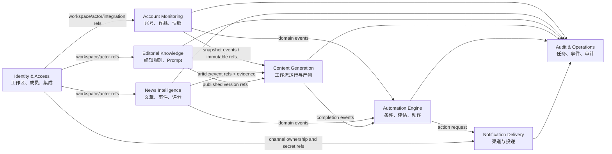

# Sports Intelligence OS 领域模型

文档状态：Prompt 01 架构基线  
更新日期：2026-07-25

## 1. 建模原则

- 以 Bounded Context 分隔模型；相同词在不同 Context 中必须明确含义。
- 聚合只保护必须同步一致的规则；历史快照、步骤产物和投递尝试独立持久化，避免超大聚合。
- 第三方 DTO、ORM 模型和领域对象相互分离。
- 核心字段使用明确列；Provider 特有扩展可进入受 schema 版本约束的 JSONB，但不能建立“所有实体/指标共用一张万能表”。
- 所有外部对象携带来源元数据；所有版本化对象发布后不可原地修改。
- “编辑规则”和“自动化规则”是两个不同概念，API、表名和代码命名不得混用。

## 2. Context Map



关系约定：

- `refs` 只传内部 ID、版本号和必要快照，不共享可变对象。
- Domain event 使用版本化事件信封；消费者不得查询生产者私有表来解释事件。
- 需要强一致的操作留在同一 Context；跨 Context 通过最终一致和可重放事件协作。

## 3. 通用语言

| 术语 | 定义 |
| --- | --- |
| 工作区 Workspace | 数据与权限隔离边界；每个业务实体归属一个工作区 |
| Provider Connection | 一个 Provider 的可用配置和加密秘密引用，不等于具体平台账号 |
| Platform Account | 外部平台账号在系统中的规范化身份 |
| Media Item | 一个外部平台作品；首期主要是视频，但模型不强制只有视频 |
| Snapshot | 某个观察时间点的不可变指标集合 |
| Source Kind | `live`、`imported` 或 `mock`，表示数据获得方式 |
| News Article | 单一来源的一篇报道；重复内容仍可能是不同来源报道 |
| News Event | 多篇文章描述的同一现实事件的聚类 |
| Editorial Rule | 约束内容研究、叙事、审查或输出的结构化规则，例如 7.9 规则 |
| Automation Rule | 监听领域事件并决定是否执行动作的条件树 |
| Prompt Version | 已固定内容、变量 schema 和用途的不可变 Prompt 版本 |
| Generation Run | 一次固定输入和版本依赖的完整内容生成实例 |
| Generation Step | 生成工作流中的一个持久化阶段 |
| Notification Channel | 工作区配置的一个投递目的地及 Provider 类型 |
| Delivery Attempt | 对一个通知的一次真实发送尝试 |
| System Event | 面向运营可查询的系统活动记录，不等同于安全审计日志 |
| Audit Entry | 对敏感读取或状态变更的追加式、不可变记录 |

## 4. Identity & Access

### 4.1 聚合与实体

**User 聚合**

- `User`：邮箱、显示名、密码哈希、状态、默认语言/时区。
- `Session`：哈希后的会话令牌、创建/过期/撤销时间、设备摘要。

**Workspace 聚合**

- `Workspace`：名称、slug、状态和默认时区。
- `Membership`：用户、角色、状态；Owner 至少保留一人。

**IntegrationConnection 聚合**

- Provider 类型、显示名、配置、能力、秘密引用、验证状态。
- 秘密值由加密服务保存；领域对象只知道 `secret_ref`。

### 4.2 不变量

- 任何工作区级命令必须有活动 Membership。
- 删除最后一个 Owner 被拒绝；角色变更写审计。
- 邮箱规范化后唯一；密码、会话和 Provider Token 永不明文存储。
- `mock` 连接无法变更为 `live`；需要新建真实连接，避免历史来源混淆。

## 5. Account Monitoring

### 5.1 聚合与实体

**PlatformAccount 聚合**

- 内部 ID、工作区、Provider key、Connection ID、外部账号 ID、handle/URL、显示名、来源类别、同步状态、时区和 Provider 扩展。
- 同一工作区、Provider、外部账号 ID 唯一。

**MediaItem 聚合**

- 所属 PlatformAccount、外部作品 ID、类型、标题、描述、发布时间、时长、URL、语言、可见状态和 Provider 扩展。
- 身份/元数据可更新，但更新需记录 `last_source_observed_at`；指标不写入本表。

**AccountSnapshot / MediaSnapshot**

- 不可变时间序列记录；`observed_at` 表示平台数据观察时间，`fetched_at` 表示请求完成时间。
- 核心可比指标为明确列；平台特有指标进入相应扩展表或 schema 化扩展。
- 同一同步运行、主体和观察时间使用唯一键防重复。

**SyncSchedule / SyncRun**

- Schedule 定义频率、启停、下次运行；Run 记录触发方式、状态、游标、计数、错误和幂等键。

### 5.2 指标值对象

- `MetricValue(value, unit, quality, source_field, algorithm_version?)`
- `quality`：`reported`（平台原始）、`derived`（系统推算）、`unavailable`（仅能力响应，不落数值）。
- 派生值必须引用输入快照范围和算法版本。

### 5.3 不变量

- Snapshot 创建后不可更新数值；更正通过新快照或显式修正记录完成。
- `source_kind=mock` 的账号、作品、快照和事件必须始终保持 `mock`。
- 平台未提供的指标不得填 0；0 是有效报告值，缺失使用 null + capability/availability 描述。
- 发布于未来的外部时间保留原值并标异常，不用抓取时间静默覆盖。

## 6. News Intelligence

### 6.1 聚合与实体

**NewsSource 聚合**

- Provider key、类型、名称、URL、语言、来源等级、抓取策略、启停和连接引用。

**NewsArticle 聚合**

- 来源、外部 ID、规范化 URL、标题、摘要、正文引用、作者、语言、published_at、fetched_at、事件发生时间范围、内容指纹和来源元数据。
- `ArticleRevision` 保存同一 URL/外部 ID 的内容更新和哈希，不覆盖历史正文。

**NewsEvent 聚合**

- 规范化标题、摘要、运动、状态、时间范围、聚类/评分算法版本。
- `EventArticleLink` 记录文章、关联置信度、角色（首报/更新/重复/背景）和人工确认。
- `EventEntityLink` 关联人物、队伍、赛事、国家等规范化实体。

**NewsScoreSnapshot**

- 热度、时效性、可信度、素材可获得性、争议度、视觉冲击度、反转度、短视频适配度及解释；评分随算法和时间变化，使用快照。

### 6.2 不变量

- `published_at` 与 `fetched_at` 分开；无法确认发布时间时 `published_at=null`。
- URL 去重和内容指纹是候选信号，不自动删除不同来源文章。
- 自动聚类可被人工覆盖；后续算法重跑不得覆盖人工确认。
- 可信度和热度是系统评分，不冒充事实；必须带算法版本和解释。

## 7. Editorial Knowledge

### 7.1 EditorialRuleSet 聚合

> Prompt 06 首期实际模型为 `RuleSet`、`RuleSetVersion`、`RuleSection`、`Rule`。为严格满足本阶段指定字段，原文、文件哈希和导入版本元数据直接冻结在 RuleSetVersion；独立对象存储 SourceArtifact 在出现大文件复用需求前不提前引入。Rule 的详情、示例、关系与标签当前使用明确列和有界数组表达，不使用万能节点表。

- `RuleSet` 是稳定身份和元数据。
- `RuleSetVersion` 是不可变版本，状态为 `draft`、`published`、`archived`；发布后编辑必须创建新草稿。
- `SourceArtifact` 保存 7.9 原文的对象引用、SHA-256、字符编码、文件名和导入信息。
- `RuleNode` 表达 chapter、section、rule 等有序树节点。
- `RuleDetail` 表达说明、Why、How、QA Check、Rewrite Instruction、优先级、强制性和适用范围。
- `RuleExample` 分 Good/Bad；`RuleRelation` 分 depends_on/conflicts_with；`Tag` 可复用。

### 7.2 PromptTemplate 聚合

- `PromptTemplate` 是用途明确的稳定身份，如 `fact_extraction`。
- `PromptVersion` 保存不可变模板正文、变量 schema、输出 schema、模型约束、状态和校验和。
- `PromptTestCase` 保存去敏后的输入、预期结构/断言，不保存真实秘密。

### 7.3 不变量

- 每个已发布版本不可变；回滚是将旧版本重新设为当前发布引用，不修改旧记录。
- 结构化规则必须可追溯到原文范围或标记为用户新增。
- 依赖和冲突关系只能指向同一版本内存在的规则，并通过环检测。
- Prompt 变量必须声明；运行时未声明变量和缺失必填变量均拒绝渲染。

## 8. Content Generation

### 8.1 GenerationRun 聚合

- `GenerationRun`：工作区、创建者、状态、输入快照、固定的 RuleSetVersion/PromptVersion/Provider Model 引用、参数、当前步骤、取消标记。
- `GenerationInput`：类型化引用和创建时快照；避免源文章后来更新导致历史运行漂移。
- `GenerationStep`：阶段、尝试号、状态、开始/结束、输入/输出 artifact、Provider 请求元数据、错误。
- `GenerationArtifact`：facts、timeline、qualification、draft、review、qa、rewrite、final、title、translation、keywords、material suggestions、SSML、SRT 等类型化产物。
- `ModelUsage`：输入/输出/缓存 Token、调用次数、价格快照、成本、币种、延迟。
- `GenerationDecision`：用户评分、采用/拒绝、备注和时间。

### 8.2 状态机

`queued → running → succeeded | failed | cancelled`。单步骤为 `pending → running → succeeded | failed | skipped | cancelled`。重试创建新 attempt，旧 attempt 不覆盖。

### 8.3 不变量

- 运行开始前必须固定所有版本和输入哈希。
- 没有证据的事实标为未核实，不能在 QA 中自动变成“已核实”。
- 最终结果只可来自成功的 QA/Rewrite 路径；跳过步骤必须由工作流定义允许并记录原因。
- Token 和成本来自 Provider 报告或明确标记的估算，二者不可混淆。

## 9. Automation Engine

### 9.1 AutomationRule 聚合

- 稳定 Rule 身份、名称、启停、优先级、标签、适用事件类型。
- `AutomationRuleVersion` 保存不可变条件 AST、动作定义、冷却、去重窗口和 schema 版本。
- `RuleEvaluation` 保存事件、版本、结果、解释树、读取的指标时间范围和错误。
- `RuleRuntimeState` 保存连续满足计数、最后命中/执行时间和窗口状态，不修改规则定义。
- `ActionExecution` 保存动作类型、参数快照、幂等键、状态、结果引用和错误。

### 9.2 不变量

- 评估器只读取已持久化的规范化事件/指标，不在评估中调用第三方平台。
- 表达式不执行任意 Python/JavaScript；字段和函数使用白名单。
- 相同 RuleVersion、Event 和 Action 的幂等键唯一。
- 冷却阻止动作但不隐藏评估结果；用户能看到“条件满足但处于冷却”。

## 10. Notification Delivery

### 10.1 聚合与实体

**NotificationChannel 聚合**

- Provider key、显示名、启停、非秘密配置、秘密引用、验证状态和 `source_kind`（测试渠道可标 mock）。

**Notification 聚合**

- 主题、结构化消息、模板版本、目标 Channel、来源 ActionExecution、幂等键和状态。
- `DeliveryAttempt` 记录请求时间、Provider message ID、响应分类、耗时、下次重试和安全摘要。

### 10.2 不变量

- 规则只引用 Channel ID，不保存 Token 或 Provider 请求体细节。
- 未验证/禁用渠道不能显示成功；测试发送也必须产生投递记录。
- Provider 响应中的秘密和敏感 URL 参数在存储前脱敏。

## 11. Audit & Operations

### 11.1 模型

- `TaskRun`：任务类型、队列、状态、幂等键、尝试、计划/开始/结束时间、进度、错误和关联资源。
- `OutboxEvent`：版本化事件信封、发布状态、尝试和下一次发布。
- `SystemEvent`：面向运营人员的活动流，可包含成功、警告、失败。
- `AuditEntry`：actor、动作、资源、前后摘要、IP/用户代理摘要、原因、trace，追加式保存。
- `ExternalCallLog`：Provider、操作、状态、耗时、限流信息、错误分类和去敏请求 ID；不保存秘密。

### 11.2 区分

System Event 用于“发生了什么”和故障排查，可按保留策略清理；Audit Entry 用于“谁在何时改变了什么”，权限更严格且不能普通删除。应用日志不是审计记录的替代品。

## 12. 领域事件信封

所有跨 Context 事件使用以下逻辑结构：

```json
{
  "event_id": "uuid",
  "event_type": "media.snapshot.recorded",
  "schema_version": 1,
  "workspace_id": "uuid",
  "subject": {"type": "media_item", "id": "uuid"},
  "occurred_at": "2026-07-25T00:00:00Z",
  "recorded_at": "2026-07-25T00:00:01Z",
  "source": {"kind": "live", "provider": "youtube"},
  "data": {},
  "trace_id": "uuid",
  "correlation_id": "uuid",
  "causation_id": "uuid-or-null"
}
```

事件 `data` 按 `event_type + schema_version` 校验。事件不包含访问令牌、完整原始响应或无关个人信息。

## 13. 首期与后续模型边界

首期落实上述模型中支撑垂直切片的字段和关系；P2 能力可保留概念与扩展点，但不预建空表。以下内容后续按证据增加：高级组织层级、审批流、内容日历、自动发布、完整体育知识图谱、跨工作区共享模板和计费订阅。
