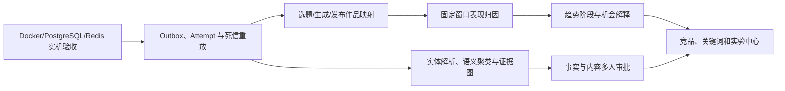

# 行业对标与产品优化建议

评估日期：2026-07-26  
评估范围：第一次交付完成后的 Sports Intelligence OS 代码、文档和可运行链路

## 结论

项目的产品方向和技术边界合理：账号/作品监控、新闻事件、结构化规则、Prompt 工作流、自动化与通知已经形成统一数据链路，Adapter/Provider、历史快照、版本管理和来源标记也避免了常见的“静态后台”问题。当前不需要更换技术栈或重写核心架构。

与成熟的社交视频情报、创作者增长和市场情报产品相比，最大的产品缺口是尚未形成“选题发现 → 内容生成 → 实际发布作品 → 表现归因 → 规则/Prompt 改进”的闭环。第二类缺口是趋势、异常和事件判断仍偏基础，用户能看到分数，但还不能稳定回答“为什么现在值得做、证据是什么、趋势正在上升还是已经见顶”。

## 对标依据

本评估只使用厂商官方产品页或官方文档，相关功能描述代表厂商公开能力，不代表本项目已经拥有同等数据规模：

- [Tubular Intelligence](https://tubularlabs.com/products/tubular-intelligence/)：跨平台视频和创作者比较、标准化表现、固定发布后窗口评分、趋势速度、分类与自定义列表。
- [Tubular Trending](https://tubularlabs.com/trending/)：比较 3/7/30/90 天趋势，识别正在上升、失速或已经见顶的主题、创作者和标签。
- [vidIQ Enterprise](https://enterprise.vidiq.com/)：关键词研究、竞品情报、每日趋势、创意生成、缩略图测试和团队管理。
- [Feedly AI Feeds 文档](https://docs.feedly.com/article/699-guide-to-ai-feeds-market-intel)：通过 AND/OR/NOT、可信来源范围和可持续细化的语义主题降低新闻噪声，并把结果接入自动化。
- [Feedly Ask AI](https://feedly.com/new-features/posts/new-feedly-ask-ai-from-information-overload-to-actionable-insights)：多文章、多语言综合，强调可信来源、行内引用和输出结构控制。
- [Hootsuite 平台](https://www.hootsuite.com/platform)：把监听、趋势、竞品、内容、审批、发布和效果分析放入统一运营流程。
- [Hootsuite 审批工作流](https://www.hootsuite.com/platform/social-media-approval-tool)：按权限、内容类型和顺序配置多人审批，并保留审核操作。

## 当前能力与差距

| 领域 | 当前项目 | 行业优秀做法 | 建议 |
| --- | --- | --- | --- |
| 视频监控 | 统一账号/作品、历史快照、速度、加速度、爆款分 | 固定发布后窗口、竞品基线、趋势生命周期、可解释异常 | 保留现有模型，增加基线版本、异常解释和趋势阶段 |
| 新闻情报 | RSS/Atom/JSON、哈希/标题去重、基础事件聚类 | 语义概念、可信源范围、多语言聚合、证据引用 | 增加实体解析、跨语言语义聚类和逐结论证据 |
| 内容生成 | 7.9 规则、版本化 Prompt、十步工作流、QA/重写 | 从实时情报到制作、审批、发布和复盘的闭环 | 增加发布映射、审批与表现归因，不直接自动发布 |
| 选题优先级 | 热度、可靠度、故事/视觉/争议评分 | 机会空间、受众匹配、竞品饱和度、趋势阶段 | 增加可解释 Opportunity Score，而非再加黑盒总分 |
| 团队协作 | 工作区角色、审计、选题状态 | 多人审批、内容日历、任务指派、审批 SLA | 增加可配置审核流和制作看板 |
| 自动化可靠性 | 冷却、去重、有限重试、失败记录 | Outbox、逐次尝试、死信、重放、升级策略 | 先补可靠性，再增加更多渠道或更高频扫描 |

## 建议优先级

### P0：第二阶段首先完成

1. **内容效果闭环与归因**

   为选题、GenerationRun 和最终发布的 ContentItem 建立可审计关联，记录实际采用的标题、Hook、规则、Prompt 和发布时间。发布后按 1/3/6/24/72 小时和 7/30 天回收表现，比较账号基线与同类题材。这样才能回答哪些规则、叙事结构和选题真正有效，而不是只统计生成次数。

2. **可解释趋势与异常检测**

   在现有速度、加速度和 `account_baseline_ratio` 上增加趋势阶段：`emerging`、`accelerating`、`peaking`、`declining`。每个结论保存比较窗口、基线样本数、缺失字段、触发贡献和算法版本。首期可使用稳健统计与可配置阈值，不必立即引入重型机器学习平台。

3. **跨语言事件解析和证据图**

   增加人物、球队、赛事、地点和比赛时间的规范实体；以标题、摘要、实体和时间共同聚类。每个事实结论关联具体 Article、原始 URL、发布时间和摘录位置；生成工作流只能引用已冻结的证据包。低置信事件进入人工合并/拆分队列。

4. **人工审核与制作工作流**

   在自动生成和任何外部发布之间增加可配置状态：选题审核、事实审核、文案审核、素材/版权审核、最终批准。支持负责人、截止时间、批注、驳回原因、版本差异和完整审计。第一阶段不建议无人值守自动发布。

5. **任务投递可靠性**

   完成事务 Outbox、逐次外部调用 Attempt、死信/重放和通知升级策略；继续对已实现的会话清理做 Docker/PostgreSQL/Redis 故障注入测试。此项是把 30 秒扫描升级为更可靠实时系统的前提。

### P1：闭环稳定后增加

1. **竞品观察列表和保存视图**：支持自有/竞品分组、保存筛选、共享仪表盘、定时报表和同发布时间窗口的客观比较。
2. **关键词机会中心**：整合获准的搜索/趋势来源，展示需求、增长方向、竞争度、账号适配度和相关内容；不能用模型猜测搜索量冒充平台数据。
3. **内容实验**：对标题、Hook、叙事顺序和缩略图维护实验版本；只有平台提供或用户授权的数据才标为真实 A/B 结果，否则使用观察性对照并显示偏差提示。
4. **受众与品牌适配**：在授权的 Analytics 数据基础上加入地域、语言、观看时长、受众重合和账号语气配置；缺少 OAuth 私有数据时明确显示不可用。
5. **素材权利与可用性**：素材搜索结果附来源、许可、地域限制、到期时间、证据和审核状态，防止“可搜到”被误认为“可商用”。

## 不建议现在增加

- 不为扩大平台数量而使用绕过登录、验证码或访问限制的采集方式。
- 不在数据规模尚未证明前引入 Kubernetes、Kafka、ClickHouse 或 Elasticsearch。
- 不增加无法解释来源和算法版本的“AI 热度分”。
- 不让前端或 LLM 直接调用第三方发布接口，也不默认开启无人审核的自动发布。
- 不把模型生成的搜索量、受众画像、比赛事实或平台私有指标显示为真实数据。

## 推荐的数据模型增量

- `Publication`：生成结果与实际平台作品的映射、发布时间、采用版本和发布状态。
- `PerformanceAttribution`：固定窗口表现、基线、实验组、规则/Prompt 版本和算法版本。
- `TrendSignal`：对象、窗口、阶段、速度、置信度、贡献因素和证据。
- `CanonicalEntity` / `EntityMention` / `FactEvidence`：规范实体、文章提及和事实证据。
- `EditorialReview` / `ApprovalStep`：审核流、负责人、决定、批注和 SLA。
- `DeliveryAttempt` / `DeadLetter`：每次外部请求、可重试分类、下次重试和重放记录。

所有增量继续保留 `source_kind`、Provider、外部 ID、抓取时间和算法/配置版本，不修改已发布规则或 Prompt 版本。

## 第二阶段验收指标

- 90% 以上被采用生成结果可以映射到实际作品，并在固定窗口产生归因记录。
- 趋势信号均能展示基线、窗口、样本数、贡献因素和证据，不产生无来源分数。
- 跨来源事件人工抽检的错误合并率和漏合并率有持续可见统计。
- 任何生成事实都能追溯到至少一个原始来源；未充分核实时保持 `verification_incomplete`。
- 审批、驳回、修改、发布和自动化动作均进入审计记录。
- Worker 中断、通知超时和外部 5xx 可重试、可进入死信并可人工重放，不重复产生业务副作用。

## 实施顺序

这个顺序优先补齐可运行和可审计基础，再让更高级的情报和 AI 功能建立在真实反馈数据上。
