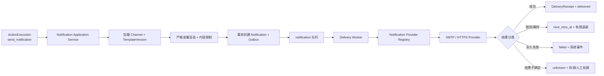

# 通知系统设计

文档状态：Prompt 01 设计基线  
更新日期：2026-07-25

## 1. 设计目标

通知系统把“为何通知”与“如何发送”分开：Automation Engine 决定动作，Notification Delivery 根据 Channel 和模板生成一次 Notification，再由具体 Provider 发送。

首期统一接口面向邮件、通用 Webhook、Telegram、Discord、飞书、钉钉和企业微信。垂直切片验收至少真实打通邮件或 Webhook；其余渠道必须按实施阶段明确已验证或未验证，不以 Mock 成功替代。

## 2. 组件与流程



## 3. 规范化消息

```python
@dataclass(frozen=True)
class RenderedNotification:
    subject: str
    text: str
    markdown: str | None
    html: str | None
    facts: tuple[MessageFact, ...]
    links: tuple[SafeLink, ...]
    severity: Literal["info", "warning", "critical"]
    locale: str
    occurred_at: datetime
    source_kind: SourceKind
```

Provider 选择最适合渠道的表示，例如邮件用 text/html，Discord/飞书可用安全 Markdown/卡片，Webhook 使用版本化 JSON。Provider 不重新调用 LLM，也不改变事实含义。

### 内容限制

- 渲染前按 ChannelCapability 校验主题、正文、字段和 URL 数量。
- 超长内容通过确定性截断 + 本系统详情链接处理，并明确“已截断”；不让各 Provider 随机截断。
- HTML 使用安全模板和转义；Markdown 处理渠道特殊字符，禁止未验证原始 HTML。
- `mock` 事件的消息标题和正文必须带“模拟/测试”标记。

## 4. Channel 配置

NotificationChannel 保存：Provider key、显示名、启停、非秘密配置、秘密引用、验证状态、最近验证时间和乐观锁版本。

非秘密配置示例：

- SMTP：from name/address、收件人列表引用、TLS 模式；用户名/密码为秘密。
- Webhook：允许的目标 URL（加密或视为敏感）、签名模式、请求头名称；秘密头值为秘密。
- Telegram：chat ID 可视敏感配置；bot token 为秘密。
- Discord：Webhook URL 整体按秘密保存。
- 飞书/钉钉/企业微信：Webhook URL、secret/token 按秘密保存。

API 写入秘密后只返回 `configured: true` 和掩码摘要，永不回显原值。导出配置不含秘密。

## 5. Provider 接口

```python
class NotificationProvider(Protocol):
    descriptor: ProviderDescriptor

    async def verify_channel(
        self,
        ctx: ProviderCallContext,
        config: ChannelConfig,
    ) -> ChannelVerification: ...

    async def send(
        self,
        ctx: ProviderCallContext,
        destination: Destination,
        message: RenderedNotification,
        idempotency_key: str,
    ) -> DeliveryReceipt: ...
```

```python
@dataclass(frozen=True)
class DeliveryReceipt:
    status: Literal["delivered", "accepted", "unknown"]
    provider_message_id: str | None
    provider_request_id: str | None
    accepted_at: datetime | None
    response_summary: Mapping[str, Any]
```

`accepted` 表示 Provider 接受请求，不保证最终用户阅读；UI 不显示“已读”。`unknown` 表示超时等情况下不能确认是否产生副作用。

## 6. 渠道能力矩阵

| Provider | 传输 | 首期认证 | 主要格式 | 幂等现实 |
| --- | --- | --- | --- | --- |
| Email | SMTP（后续可加 API） | 用户名/密码或应用密码 | text + sanitized HTML | SMTP 通常无原生幂等，本地去重 |
| Generic Webhook | HTTPS POST | HMAC/secret header 可选 | `application/json` | 传 `Idempotency-Key`，接收方是否支持需记录 |
| Telegram | 官方 Bot API | bot token | text/受限 Markdown | 本地去重；保存 message ID |
| Discord | 官方 Webhook | webhook URL | content/embeds | 本地去重；可等待响应 ID |
| Feishu | 官方自定义机器人 Webhook | webhook + signature secret | text/post/card 子集 | 本地去重；签名时钟校验 |
| DingTalk | 官方自定义机器人 Webhook | webhook + secret | text/markdown | 本地去重；签名时钟校验 |
| WeCom | 官方群机器人 Webhook | webhook key | text/markdown | 本地去重 |

首期只实现官方文档允许的通道，不模拟用户网页登录或绕过安全机制。

## 7. 通用 Webhook 协议

请求体版本化：

```json
{
  "schema_version": 1,
  "notification_id": "uuid",
  "event_type": "sports_intelligence.alert",
  "workspace_id": "uuid",
  "severity": "warning",
  "subject": "视频增长提醒",
  "text": "...",
  "facts": [],
  "links": [],
  "source": {"kind": "live", "provider": "youtube"},
  "occurred_at": "2026-07-25T00:00:00Z",
  "trace_id": "uuid"
}
```

请求头：`Content-Type`、`User-Agent`、`X-SIO-Event-Id`、`Idempotency-Key`、可选 `X-SIO-Timestamp` 和 `X-SIO-Signature`。HMAC 使用时间戳 + 原始 body，接收方应限制重放窗口。

### SSRF 防护

- 仅允许 HTTPS（开发环境显式允许本地测试目标）。
- 解析并阻止 loopback、link-local、私网、保留地址、云 metadata；DNS 重绑定需在连接时复核目标 IP。
- 限制端口、重定向次数、响应大小和 deadline。
- 用户自定义请求头采用 allowlist，禁止覆盖 Host、Content-Length、Authorization 等，秘密头单独保存。

## 8. 模板与渲染

Notification Template 使用不可变版本，包含主题、text/markdown/html 模板、变量 JSON Schema、locale 和格式。允许变量来自 Action 参数与安全事件摘要。

- 严格模式拒绝未知/缺失变量。
- 默认转义所有外部值。
- 链接必须是本系统生成或通过 URL 策略验证。
- 模板发布需要测试渲染和每个目标 Provider 的长度验证。
- 规则引用 TemplateVersion 或“当前发布版本”策略必须在动作创建时固定为具体版本。

## 9. 投递状态机

Notification：`queued → delivering → delivered | failed | unknown | cancelled`。  
Attempt：`pending → running → succeeded | retry_scheduled | failed | unknown`。

规则：

- 创建 Notification 时生成唯一 `idempotency_key`。
- Worker 开始前锁定行并创建 Attempt；崩溃恢复时检查过期 heartbeat。
- 429/显式 retry-after 按 Provider 指示重试；网络/5xx 使用指数退避 + jitter。
- 401/403、配置无效、目标不存在等永久错误不自动重试，并将 Channel 标记需要处理。
- 总尝试默认 3 次，可按 Provider 配置更低；禁止无限重试。
- `unknown` 不自动再次发送，除非 Provider 支持按请求 ID 查询或管理员确认重试，避免重复通知。

## 10. 去重、冷却与通知风暴

- Automation 冷却控制业务层“是否创建动作”。
- Notification 幂等控制技术层“同一动作是否重复发送”。
- Channel 级速率限制控制短时容量。
- 三层都保留自己的状态和原因，不相互替代。

大规模命中时可以聚合成摘要是后续能力；首期超过工作区/Channel 限制时延迟并产生系统警告，不静默丢弃。

## 11. 测试发送

用户点击“测试渠道”会创建真实 `Notification` 和 `DeliveryAttempt`，消息显著标记测试，写审计并受限流。测试成功只证明当时配置可发送，不代表业务规则已启用。

Mock Notification Provider 仅用于自动化测试，回执 `source_kind=mock`；不能把 Mock 测试标为 SMTP/Webhook 实际通过。

## 12. 安全与审计

- 创建、修改、验证、测试和删除 Channel 均需 `notifications:manage` 并写 AuditEntry。
- 日志不记录完整 webhook URL、bot token、SMTP 密码、完整收件人或消息中的敏感正文。
- Provider response 只保存白名单字段和安全摘要。
- 外部消息带最少必要信息；敏感详情通过需要登录的本系统链接查看。
- 禁用 Channel 后不再创建新投递；队列中待发送项默认取消并记录原因，管理员可选择迁移目标。

## 13. 首期实施顺序

1. Notification Port、Registry、Channel/Notification/Attempt 数据模型与 Mock 契约测试。
2. 通用 Webhook（含签名、SSRF 防护、幂等头）和 SMTP Email。
3. 先用其中一个完成垂直切片真实验收。
4. Telegram、Discord、飞书、钉钉、企业微信 Provider；分别做官方测试环境或受控真实 smoke test。
5. UI 配置、测试发送、投递历史和失败处理。

渠道只有在契约测试和对应真实 smoke test 均通过后才标为“已验证”；无凭证时标“实现完成，真实环境未验证”。

## 14. 后续能力

Slack、Microsoft Teams、PushPlus、Server 酱、Bark、短信、移动推送、摘要合并、升级策略、值班轮换和最终送达回执按插件扩展。新增渠道不修改 Automation 评估器和已有 Provider。
