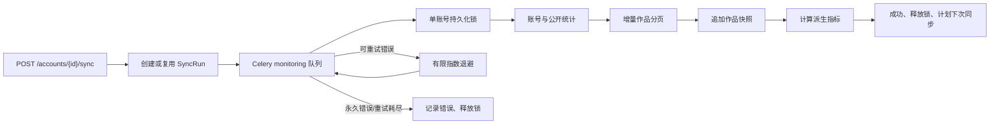

# 平台适配器与监控任务

文档状态：Prompt 04 已实现  
更新日期：2026-07-25

## 1. 实现边界

平台差异位于 `apps/api/app/adapters/platforms/`，应用服务只依赖 `PlatformAdapter`、规范化 DTO、能力声明和统一错误分类。当前注册表包含：

| Adapter | 状态 | 数据边界 |
| --- | --- | --- |
| `youtube` | 已实现 | 仅 YouTube Data API v3 可公开取得的频道、公开视频与公开统计，`source_kind=live` |
| `mock_platform` | 已实现 | 确定性合成账号、作品、快照、增长与异常，固定 `source_kind=mock` |
| `tiktok` | 骨架 | 明确抛出 `AdapterNotImplementedError`，不返回数据 |
| `douyin` | 骨架 | 明确抛出 `AdapterNotImplementedError`，不返回数据 |
| `bilibili` | 骨架 | 明确抛出 `AdapterNotImplementedError`，不返回数据 |

YouTube 私有 Analytics 数据（流量来源、留存、收入、搜索词、粉丝归因等）未接入 OAuth，也不会推算或伪造。相关值返回 `None`，并在 `unavailable_metrics` 和能力声明中标明不可用。

## 2. Adapter 契约

统一协议提供 `validate_config`、`resolve_account`、`fetch_account`、`list_contents`、`fetch_content`、`fetch_account_analytics`、`fetch_content_analytics` 和 `health_check`。Capabilities 包括：

`PUBLIC_PROFILE`、`ACCOUNT_ANALYTICS`、`CONTENT_LIST`、`CONTENT_ANALYTICS`、`TRAFFIC_SOURCES`、`RETENTION`、`REVENUE`、`COMMENTS`、`SEARCH_TERMS`。

YouTube Adapter 使用官方 `channels.list`、上传播放列表的 `playlistItems.list` 和批量 `videos.list`：

- 单页最多 50 条，并保留不透明 `nextPageToken`；
- 使用最近本地发布时间作为增量检查点；
- 未由 `videos.list` 返回的私有、删除或不可访问条目保留为 `status=unavailable`，不删除历史；
- 401、权限、无效频道、配额、429、5xx、网络超时与响应契约错误分别映射；
- 外部请求有超时、有限重试、指数退避、可选请求间隔和结构化安全日志；日志不包含 API Key。

## 3. 同步执行与去重

`sync_runs` 持久化目标、Adapter、排队/开始/结束时间、状态、创建/更新计数、错误码、错误摘要、请求 ID 与元数据。`lock_key` 在 `queued/running` 期间唯一，终态释放，以防单账号重复任务跨 Worker 并发执行。

账号同步按以下原子工作流运行：



Celery 暴露 `sync_account`、`sync_account_contents`、`sync_content_metrics`、`sync_all_due_accounts` 和 `calculate_derived_metrics` 五个命名任务。首期三个采集入口收敛到同一个账号级原子工作流，避免作品列表与指标快照产生部分成功；任务名保留给后续按平台配额拆队列。

## 4. API 与界面

- `POST /api/v1/accounts/{id}/sync`：创建可审计任务并返回 202；活动任务存在时幂等返回同一任务。
- `GET /api/v1/accounts/{id}/sync-runs`：分页查看最近运行、计数和错误。
- 账号详情/列表返回 `sync_status`、`last_synced_at`、`next_sync_at`、`last_sync_error_code` 和 `last_sync_error_message`。
- Dashboard 显示最近账号来源、同步状态、错误与下一计划时间；Mock 账号额外显示“模拟数据”。

写操作仍需会话、CSRF 和工作区角色；前端从不直接调用 YouTube，也不接触 API Key。

## 5. 配置

```dotenv
SIO_YOUTUBE_API_KEY=
SIO_PLATFORM_REQUEST_TIMEOUT_SECONDS=10
SIO_PLATFORM_REQUEST_MAX_ATTEMPTS=3
SIO_SYNC_TASK_MAX_RETRIES=3
SIO_SYNC_PAGE_LIMIT=20
```

API Key 仅从环境读取，不写数据库、任务参数、日志或代码库。未配置 Key 时 YouTube 任务以 `adapter_configuration_error` 失败并可在界面查看；系统不会回退到 Mock 并冒充成功。

## 6. 已知限制

- YouTube Analytics API 私有字段、OAuth 授权与 Comments 尚未实现。
- TikTok、抖音、Bilibili 只有真实能力声明与配置骨架；调用会明确失败。
- 当前调度周期为账号字段加 Celery Beat 每分钟扫描；尚未实现按平台配额预算、随机抖动和分片调度。
- 本机无 Docker，未验证真实 Redis Worker 和 PostgreSQL 容器；Mock 执行闭环、HTTP 契约、SQLite 迁移升降级和静态 Compose 检查已自动化验证。
