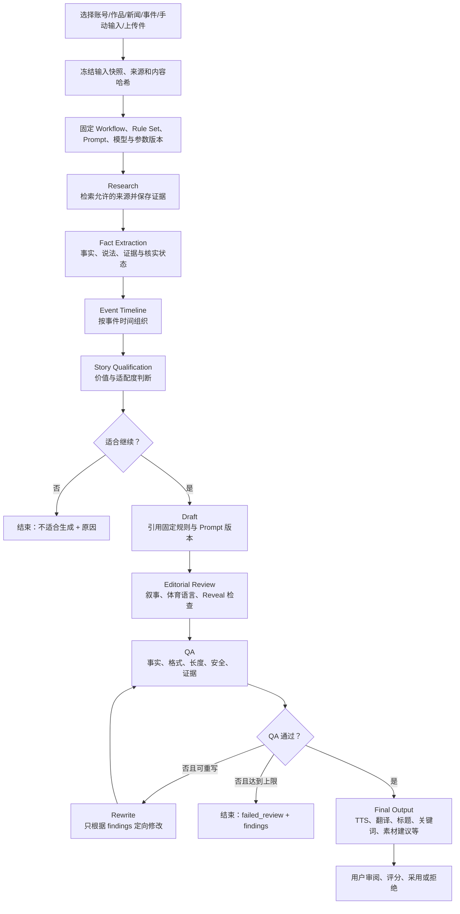

# Prompt 与内容生成引擎设计

文档状态：Prompt 01 设计基线  
更新日期：2026-07-25

## 1. 目标与核心约束

内容生成中心是持久化、版本化、可恢复的工作流，不是“一个文本框 + 一次 LLM 调用”。每次运行必须固定输入、Editorial Rule 版本、Prompt 版本、Workflow 版本、Provider、模型与参数，并保存各阶段产物和事实证据。

产品界面不等于内部编排器。普通创作者只看到素材选择、规则预设、少量业务化成片选项和结构化最终产物；Prompt 版本、Provider、模型参数和内部步骤由系统根据已发布工作流与工作区设置自动解析，只在折叠审计区和后台 API 中保留。这样既维持可追踪的多阶段质量链路，也不会把产品变成专业 LLM 调试工具。

Prompt 正文、变量 schema 和输出 schema 保存在数据库版本表；Python 代码只实现安全渲染、步骤编排、Provider 端口和校验器，不硬编码业务 Prompt。

## 2. 内容生成工作流



工作流图是版本化定义；首期步骤顺序固定为产品要求，但步骤使用配置中的 PromptVersion 引用。后续可增加受支持步骤类型，不允许用户上传任意可执行代码。

## 3. 组件

| 组件 | 职责 |
| --- | --- |
| Workflow Definition | 声明步骤、有向边、输入映射、输出 schema、重试和跳过条件 |
| Run Orchestrator | 推进运行状态、创建步骤 attempt、取消、恢复和终止 |
| Input Freezer | 将可变来源转换为不可变输入快照、哈希和来源引用 |
| Prompt Renderer | 按变量 schema 渲染指定 PromptVersion，拒绝未知/缺失变量 |
| Rule Compiler | 将选定 Editorial RuleSetVersion 编译为适合阶段的结构化约束包 |
| LLM Provider | 统一模型请求与响应、用量、finish reason 和错误分类 |
| Evidence Store | 保存来源、摘录摘要、抓取/发布时间、核实状态和证据链接 |
| Validators | 结构、事实、字符长度、Reveal、禁用内容和输出格式检查 |
| Artifact Store | 保存每步结构化产物或大文本对象引用与哈希 |
| Cost Calculator | 以运行时价格快照计算成本，区分 Provider reported 与估算用量 |

## 4. 输入冻结

### 4.1 支持输入

- `platform_account`、`media_item`：内部资源引用 + 当前元数据/快照 ID。
- `news_article`、`news_event`：文章修订、事件摘要、关联文章和证据引用。
- `manual_event`：用户原文、语言、声明来源和创建者。
- `uploaded_file`：Storage key、SHA-256、MIME、大小、提取文本版本。
- 多输入按顺序保存，允许一个事件由多篇新闻构成。

### 4.2 冻结规则

- 运行创建时复制生成必需字段或固定到不可变 Revision/Snapshot ID。
- 后续源内容更新不改变历史运行。
- 上传文件先做大小/MIME/恶意内容检查；不信任扩展名。
- 外部文本均被标记为“不可信数据”，不可作为系统指令执行。

## 5. Prompt 版本模型

一个 PromptVersion 包含：

- 稳定模板 key 与用途/适用步骤；
- 模板正文和模板引擎版本；
- 变量 JSON Schema、输出 JSON Schema；
- 允许模型能力（structured output、上下文长度等）；
- 默认参数边界；
- 校验和、创建者、基于版本、状态和发布信息；
- 测试用例与断言。

变量示例：

```json
{
  "type": "object",
  "required": ["facts", "timeline", "editorial_rules", "target_character_count"],
  "properties": {
    "facts": {"type": "array", "maxItems": 100},
    "timeline": {"type": "array", "maxItems": 100},
    "editorial_rules": {"type": "array", "maxItems": 300},
    "target_character_count": {"type": "integer", "minimum": 200, "maximum": 5000}
  },
  "additionalProperties": false
}
```

模板渲染使用严格模式和长度预算。变量以结构化数据注入，不把用户文本拼接到“系统规则”位置。

## 6. Editorial Rule 编译

7.9 规则源文件与结构化规则共同工作：

1. 导入原文为不可变 SourceArtifact，计算 SHA-256。
2. RuleSetVersion 中的每条结构化规则追溯原文范围或标记“用户新增”。
3. 运行按运动、故事类型、输出类型、强制性和优先级筛选规则。
4. 解析依赖、检测冲突，生成有序 `CompiledRulePack`。
5. 每个步骤只接收与其职责相关的规则，减少上下文污染；QA 获得完整强制检查项。
6. 运行记录实际使用的 RuleNode ID 列表和校验和。

原始整段文本用于审计与人工查看，不能作为唯一可执行规则表示；结构化规则也不能在无原文时伪装成完整 7.9 导入。

## 7. 标准阶段契约

### 7.1 Research

输入：冻结输入、研究问题、允许的数据源策略。  
输出：`Evidence[]`，含 URL/内部资源、来源等级、发布时间、获取时间、摘录摘要、支持的 claim、来源类别和访问状态。

联网核实不是让 LLM 自称“已搜索”。Research 必须通过受控研究工具/Provider 得到可追溯证据；没有联网工具或访问失败时，运行标记 `verification_incomplete`。

### 7.2 Fact Extraction

输出 `Fact[]`：statement、entities、event_time、evidence_ids、confidence、verification_status（verified/corroborated/single_source/disputed/unverified）。事实和观点分开。

### 7.3 Event Timeline

输出按真实事件时间排列的节点，保留时间不确定性和来源冲突；不得把文章发布时间等同事件发生时间。

### 7.4 Story Qualification

输出是否继续、理由、短视频适配度、素材可用性、风险、推荐叙事角度。评分是带版本的编辑判断，不是客观事实。

### 7.5 Draft

生成符合目标语言、体育项目、风格和字符预算的草稿。7.9 默认叙事结构为 Hook → Misdirection → Contradiction → Reveal → Result，Reveal 前保护答案词。

### 7.6 Editorial Review

输出结构化 findings：规则 ID、严重度、文本范围、说明、重写指令。检查叙事顺序、每句主要功能、句间连接、体育语言、抽象悬念与事实结构。

### 7.7 QA

确定性校验优先于 LLM 审查：

- 输出 schema、必需产物和语言；
- 英文字符数按 Unicode code point/规范化后的明确算法统计，目标默认 1200–1250；
- TTS 文案换行约束、标题 Emoji、关键词大写、中文工程文件名不超过十个汉字；
- 事实 claim 是否有 Evidence，冲突是否披露；
- Reveal 前是否出现受保护答案词及其大小写/词形变体；
- 禁止机械改写、虚构或不安全内容。

LLM QA 作为补充，不替代可确定执行的检查器。

### 7.8 Rewrite

只接收原草稿、失败 findings、相关规则和事实包。每次重写产生新 Artifact；默认最多两轮，达到上限仍失败则停止并展示原因，不能无限调用。

### 7.9 Final Output

保存类型化产物：`tts_en`、`translation_zh`、`video_title`、`highlight_keywords`、`search_terms`、`material_suggestions`、`project_filename`，以及用户选择的 `ssml`、`srt`、`tags`。最终 bundle 有 schema 版本与哈希。

## 8. Workflow Definition

首期 WorkflowVersion 使用数据库图定义：

```json
{
  "schema_version": 1,
  "start": "research",
  "steps": [
    {"key": "research", "type": "research", "next": "fact_extraction"},
    {"key": "fact_extraction", "type": "llm_structured", "next": "timeline"},
    {"key": "timeline", "type": "llm_structured", "next": "qualification"},
    {"key": "qualification", "type": "qualification_gate", "next": ["draft", "stop"]},
    {"key": "draft", "type": "llm_text", "next": "editorial_review"},
    {"key": "editorial_review", "type": "llm_structured", "next": "qa"},
    {"key": "qa", "type": "deterministic_and_llm_qa", "next": ["rewrite", "final", "fail"]},
    {"key": "rewrite", "type": "llm_text", "next": "qa"},
    {"key": "final", "type": "artifact_bundle"}
  ]
}
```

发布时验证图无非法环（仅允许 QA↔Rewrite 的受限重试环）、所有 Prompt 引用已发布、输出与下一步输入 schema 兼容、终点可达。

## 9. LLM Provider 请求与响应

```python
@dataclass(frozen=True)
class LLMRequest:
    model: str
    messages: tuple[Message, ...]
    parameters: GenerationParameters
    response_schema: Mapping[str, Any] | None
    timeout_seconds: float
    idempotency_key: str
    metadata: Mapping[str, str]

@dataclass(frozen=True)
class LLMResponse:
    content: str | Mapping[str, Any]
    provider_request_id: str | None
    model: str
    model_revision: str | None
    finish_reason: str
    usage: TokenUsage | None
    usage_source: Literal["reported", "estimated", "unavailable"]
    safety_metadata: Mapping[str, Any]
```

Provider 实现 OpenAI、Anthropic、Gemini、DeepSeek、OpenRouter、Ollama 或 OpenAI 兼容接口；能力差异通过 Descriptor 描述。工作流请求“结构化输出”时，如果模型不支持原生 schema，Provider 可用受控 JSON 模式并执行严格解析，但必须记录降级模式。

## 10. 状态、幂等与恢复

- 创建 Run 支持客户端 Idempotency-Key；同一用户/工作区/输入哈希/键不重复创建。
- Worker 以 `run_id + step_key + attempt_no` 执行；数据库状态转换使用行锁/乐观锁。
- Provider 调用前持久化 attempt；调用完成后持久化响应和用量。
- 网络超时但可能已扣费时，步骤标 `unknown_provider_result`；若 Provider 支持请求查询/幂等则协调，否则人工决定，不盲目重试。
- 从最近成功步骤恢复时重新验证其 Artifact 哈希和版本引用。
- 取消是协作式；已发出的 Provider 请求可能无法终止，结果保留但 Run 不进入最终采用状态。

## 11. Token、字符与成本预算

- 在调用前估算上下文长度，按优先级裁剪非强制材料；强制规则和关键事实不可静默丢弃。
- Provider 最大上下文和输出 Token 来自 ModelCapability，不硬编码散落在业务代码。
- 字符目标与 Token 是不同概念；7.9 的 1200–1250 英文字符由确定性 QA 在最终文本上计算。
- 保存运行时价格快照、币种和用量来源；Provider 未报告用量时只能标 `estimated` 或 `unavailable`。
- 工作区可配置单次运行和每日预算；超限前停止新步骤并生成可解释错误。

## 12. 安全与 Prompt Injection

- 外部文章、字幕和上传内容均为不可信数据，以清晰数据边界注入，不允许其覆盖系统/工作流指令。
- Research 工具使用 allowlist、超时、响应大小和重定向限制；阻止 localhost、私网、云 metadata 和非 HTTP(S) 协议。
- 模型不能直接获得数据库连接、Provider Token 或 Notification Token。
- 工具调用参数由 schema 验证，工具结果再做去敏与来源标记。
- 日志保存 Prompt/输出哈希和安全摘要；完整内容只存授权业务表/对象存储，访问写审计。
- 上传内容做 MIME、大小、恶意文件扫描；首期不执行宏或嵌入脚本。

## 13. 版本与复现

一次 Run 的复现信息包括：输入快照与哈希、WorkflowVersion、RuleSetVersion、实际 RuleNode、各 PromptVersion、Provider/模型/模型修订、参数、工具与算法版本、每步 Artifact、用量和时间。

“可复现”表示配置和输入可追踪，不保证非确定性模型逐字输出相同。重跑会创建新 Run，并用 `replay_of_run_id` 关联，不能覆盖原运行。

## 14. 首期与后续

### 首期

- 一个发布的标准 Workflow；数据库 Prompt 版本；至少一个真实可配置 LLM Provider 或明确测试 Provider。
- 完整九阶段记录，允许确定性步骤不调用 LLM。
- 基础证据、事实、字符、Reveal、格式 QA；最多两次重写。
- Token/耗时/成本记录、用户评分与采用状态。

### 后续

- 多模型路由、人工审批节点、并行研究、团队评论、A/B Prompt 评估、批量生成、素材资产工作流。
- 在质量数据建立前不自动自我修改 Prompt 或发布规则版本。

## 15. 测试重点

- Prompt 变量缺失/未知、模板注入和输出 schema 失败。
- 版本发布不可变、回滚和历史 Run 固定引用。
- 各状态转换、取消、重试上限、恢复和重复任务幂等。
- 无网络工具时不得宣称事实已联网核实。
- 字符计算、Reveal 保护、十个汉字文件名、单行 TTS 等确定性 QA。
- Provider reported/estimated 用量与成本区分。
- 外部恶意指令不能覆盖系统规则或调用未授权工具。
