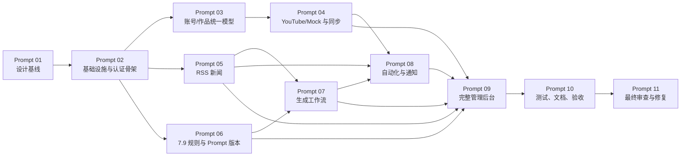

# Sports Intelligence OS 实施路线图与风险登记

文档状态：Prompt 01 规划基线  
更新日期：2026-07-25

## 1. 范围术语

- **Prompt 阶段**：用户规定的 00–11 开发顺序，是硬门禁。
- **首期 / Release 1**：最终可启动、登录和操作的垂直切片，由 Prompt 02–10 逐步实现。
- **后续版本**：Release 1 验收后，基于真实使用数据扩展的平台、规模和协作能力。

不得把某个 Prompt 阶段完成误写成 Release 1 已完成。

## 2. 首期依赖链

即使部分依赖可以并行，仍按用户提交 Prompt 的严格顺序执行。

## 3. Prompt 02：初始化项目与基础设施

### 目标

建立能启动的工程和质量基线，不提前实现大量业务。

### 实施顺序

1. 初始化 Git（若用户授权/环境需要）、根配置、`.gitignore`、EditorConfig、许可证/贡献约定。
2. 初始化 `apps/api` 与 `apps/worker`：FastAPI、SQLAlchemy 2、Pydantic 2、Alembic、Celery 的独立进程入口和共享模块边界。
3. 初始化 `apps/web`：Next.js、TypeScript、Tailwind、shadcn/ui 基础、API 客户端生成入口。
4. 建立 PostgreSQL、Redis、API、Worker、Beat、Web、Proxy 的 Docker Compose。
5. 实现配置分层、`.env.example`、Secret 类型和开发/生产校验。
6. 实现 User/Workspace/Membership/Session 最小模型、bootstrap 管理员与登录 API 骨架。
7. 建立 TaskRun、Outbox、SystemEvent、AuditEntry 基础设施。
8. 加入 lint、format、type check、unit/integration test 和 CI 基线。

### 退出条件

干净环境可启动，健康检查与登录骨架可测；秘密不入库；迁移可升级；API/Worker/Web 最小测试通过。

## 4. Prompt 03：统一账号和作品数据模型

### 实施顺序

1. 建立 monitoring Context 和来源/指标值对象。
2. 迁移 PlatformAccount、MediaItem、AccountSnapshot、MediaSnapshot。
3. 添加扩展指标、流量来源、搜索关键词和派生指标定义边界。
4. 实现 workspace-scoped 仓储、命令/查询、列表/详情/快照 API。
5. 实现筛选、稳定排序、游标分页、字段可用性和来源序列化。
6. 添加迁移、约束、仓储、权限和 API 契约测试。

### 退出条件

无 Adapter 也能通过测试 fixture 验证模型；历史快照不可覆盖；0/null、reported/derived/unavailable 和 live/mock 明确区分。

## 5. Prompt 04：平台 Adapter 与监控任务

### 实施顺序

1. 实现 PlatformAdapter Port、Registry、能力/错误/来源契约测试。
2. 实现确定性 Mock Adapter，所有层显著标记 mock。
3. 实现 YouTube 官方 API Adapter，使用去敏 fixture 映射字段和配额。
4. 实现 Connection 验证、账号解析、手动同步、SyncRun 状态机与幂等。
5. 实现 Celery 队列、限流、重试、外部调用日志和 Outbox 事件。
6. 实现 Beat 动态计划扫描和定时同步。
7. 有合法凭证时运行单独 real smoke test；没有时明确未验证。

### 退出条件

Mock 与真实路径不能混淆；重复同步不重复作品/快照；Provider 故障可追踪且不阻塞 API。

## 6. Prompt 05：体育新闻聚合

### 实施顺序

1. 实现 NewsProvider Port 与 RSS Provider。
2. 迁移 Source、Article、Revision 和基础 Event 表。
3. 实现规范化 URL、外部 ID、内容指纹和可解释基础去重。
4. 实现手动/定时抓取、失败隔离、Outbox 事件。
5. 实现新闻列表/详情、筛选、原始链接和发布时间/抓取时间区分。
6. 在真实公开且允许的 RSS 上做 smoke test；测试 fixture 另标非实时。

### 退出条件

重复拉取幂等，更新内容形成 Revision，来源/时间可追溯，错误源不拖垮其他源。

## 7. Prompt 06：7.9 规则与可视化编辑

状态：已于 2026-07-26 完成。完整原文、哈希、确定性结构化解析、版本/草稿/发布/回滚、验证、导入导出和真实 API 编辑器均已落地；PromptTemplate/Version 按用户阶段门禁保留到 Prompt 07。

### 前置输入

必须取得完整 `ELITE_SPORTS_FACELESS_NARRATION_ENGINE_V7_9_LATE_CAUSE_REVEAL_REACTION_RELAY_ANSWER_WORD_PROTECTION_FULL.txt`。缺失时可完成通用规则模型和 UI，但不得宣称 7.9 导入完成。

### 实施顺序

1. 实现 SourceArtifact 存储、SHA-256 和原文查看。
2. 实现 RuleSet/Version/Node/Example/Relation/Tag 模型和不可变发布。
3. 编写可重放导入器，将原文位置映射到结构化规则；不把 AI 解析结果直接自动发布。
4. 实现树形编辑、依赖/冲突、适用范围、QA/重写字段。
5. 实现验证、差异、回滚、导入/导出和审计。
6. 实现 PromptTemplate/Version 管理基础，为 Prompt 07 提供版本引用。

### 退出条件

原文哈希可验证，结构化规则可追溯，发布版不可原地修改，完整性和循环依赖测试通过。

## 8. Prompt 07：Prompt 与内容生成

### 实施顺序

1. 完成 Prompt/Workflow 版本模型、严格渲染和发布校验。
2. 实现 LLMProvider Port、Registry、明确测试 Provider 与至少一个可配置真实 Provider。
3. 实现输入冻结、GenerationRun/Step/Artifact/Usage 状态机。
4. 按九阶段依次实现处理器，先确定性逻辑，再接 LLM。
5. 实现证据、事实核实状态、字符/Reveal/格式 QA 和最多两次重写。
6. 实现取消、重试、恢复、预算、用量和成本记录。
7. 实现运行详情 API 与基础操作 UI。

### 退出条件

完整多阶段路径可运行并审计；无联网工具时不会宣称已核实；版本、Token、耗时、成本与最终产物可查看。

## 9. Prompt 08：规则引擎与通知

### 实施顺序

1. 实现 Automation Rule/Version、AST schema、发布验证和 dry-run。
2. 实现 Outbox Consumer、MetricResolver、三值逻辑和 Explain Tree。
3. 实现连续、冷却、去重、RuntimeState 和并发幂等。
4. 实现 ActionExecution 和系统提醒。
5. 实现 Notification Port、Channel/Notification/Attempt。
6. 优先实现 Webhook + Email 并打通一个真实垂直规则。
7. 实现 Telegram、Discord、飞书、钉钉、企业微信，分别记录真实验证状态。
8. 实现通知历史、失败处理、测试发送、限流和审计。

### 退出条件

重复事件不重复发送；未知外部结果不盲重试；一个真实或用户控制的测试目标完成端到端投递，其他渠道状态准确。

## 10. Prompt 09：前端管理后台

前面阶段可提供最小操作页面，本阶段完成产品化管理后台：

1. 统一布局、导航、权限、错误/空/加载状态和来源标签。
2. 登录、工作区、连接与通知配置。
3. 账号/作品列表详情、趋势和同步运行。
4. 新闻/事件列表详情、来源与时间线。
5. Editorial Rule/Prompt 版本编辑、差异、发布。
6. Generation 运行创建、步骤、QA 和产物。
7. Automation 可视化条件树、dry-run、评估解释和投递历史。
8. 系统事件/审计视图、响应式与可访问性。

所有页面接真实系统 API；开发 Mock 在 UI 顶部和记录级明显标记。

## 11. Prompt 10–11：验收与最终修复

Prompt 10 从干净环境执行迁移、启动、核心 E2E、备份恢复、安全、性能基线和中文文档验收。Prompt 11 进行最终正确性、安全、并发、数据真实性、可访问性和维护性审查，清除阻断/高优先级问题并回归。

## 12. 首期后路线

优先级必须由真实使用和 Provider 合规性决定：

1. 更多官方平台 Adapter（TikTok、抖音、Bilibili 等，取决于 API 可用性和授权）。
2. 更多新闻 Provider、人工事件管理和更强事件聚类。
3. 多模型策略、人工审批、团队协作和内容日历。
4. 更多通知/任务插件、摘要聚合与升级策略。
5. 基于容量证据拆分 Worker/Context，必要时引入对象存储、搜索或时序分析组件。

## 13. 高风险登记

等级：影响/概率为 高、中、低。Owner 是责任 Context，不代表已实施缓解。

| ID | 风险 | 影响 | 概率 | 设计缓解 | 验收门 |
| --- | --- | :---: | :---: | --- | --- |
| R-01 | 平台官方 API 不提供所需指标或访问受限 | 高 | 高 | 能力声明、null/quality、只用合法 API、字段可用性 UI | 不伪造缺失指标；真实 smoke 单独报告 |
| R-02 | YouTube 配额/限流导致同步不稳定 | 中 | 高 | 增量游标、配额记录、限流、退避、计划错峰 | 429 恢复测试；不无限重试 |
| R-03 | 7.9 原文件缺失或解析歧义 | 高 | 中 | SourceArtifact 哈希、人工复核、逐条追溯、导入报告 | 无原文不得标导入完成 |
| R-04 | 新闻去重误合并不同报道 | 中 | 高 | 候选信号、Revision、不同来源保留、人工覆盖 | 去重解释与回滚测试 |
| R-05 | 新闻版权/抓取条款风险 | 高 | 中 | RSS/官方 API 优先、许可策略、正文可选保存、原链接 | 每个 Provider 合规说明 |
| R-06 | LLM 幻觉或为戏剧性篡改事实 | 高 | 高 | Evidence/Fact 状态、确定性 QA、规则审查、人工采用 | 无证据 claim 标记/阻断 |
| R-07 | Prompt injection 导致越权工具或数据泄露 | 高 | 中 | 内容指令隔离、工具 allowlist、无秘密上下文、schema | 攻击样本测试不能调用未授权工具 |
| R-08 | 多阶段生成成本/延迟失控 | 高 | 中 | 预算、Token 预估、尝试上限、检查点、队列隔离 | 超预算提前停止且有记录 |
| R-09 | Celery 至少一次投递造成重复快照/通知 | 高 | 高 | 幂等键、唯一约束、Inbox/Outbox、unknown 状态 | 重复/崩溃恢复集成测试 |
| R-10 | 时间窗口在时区、乱序、稀疏数据下误判 | 高 | 中 | UTC、三值逻辑、样本/窗口解释、迟到标记 | 边界/乱序属性测试 |
| R-11 | 自定义 URL 造成 SSRF | 高 | 中 | 协议/域名/IP/端口/重定向限制、DNS 复核 | SSRF 测试套件 |
| R-12 | 多工作区 IDOR/越权 | 高 | 中 | scoped repository、双层授权、404 隐藏、RBAC | 全端点跨租户测试 |
| R-13 | Provider Token/Prompt 内容泄露到日志 | 高 | 中 | Secret 类型、集中脱敏、DTO allowlist、日志测试 | 自动 secret canary 扫描 |
| R-14 | 通知风暴或重复外部副作用 | 高 | 中 | 冷却、去重、渠道限流、幂等、unknown 不盲重试 | 并发与故障注入测试 |
| R-15 | 万能表/JSONB 造成查询与迁移失控 | 中 | 中 | 分 Context 明确表、核心列、schema 化扩展 | Schema review 拒绝通用对象表 |
| R-16 | UI 静态模拟与真实 API 脱节 | 高 | 中 | OpenAPI 生成客户端、契约/E2E、来源标签 | 关键 UI E2E 必须走 API |
| R-17 | 单机资源争抢影响 API | 中 | 中 | 队列/并发隔离、容器限制、长任务异步 | 生成/同步压力下 API 基线 |
| R-18 | Provider API 变更破坏映射 | 中 | 高 | 契约 fixture、schema 版本、映射错误隔离、原始引用重放 | 未知字段/缺失字段测试 |

## 14. 风险复核节奏

- 每个 Prompt 开始时复核相关风险、依赖和新事实。
- Provider 首次真实接入前完成条款、权限、配额和字段可用性核对。
- 每个发布候选运行高风险门禁测试；未关闭的高风险必须有 Owner、限制和用户可见说明。
- 只有真实容量证据触发架构升级，不以“未来可能”提前引入重型组件。
