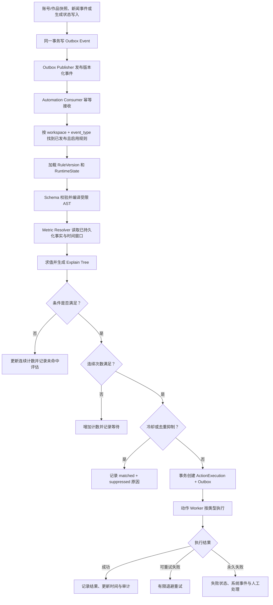

# 实时规则引擎设计

文档状态：Prompt 01 设计基线  
适用对象：Automation Rule；不等同于 7.9 Editorial Rule

## 1. 目标

规则引擎消费已经持久化的领域事件和指标快照，以可解释、可版本化、安全的条件树判断是否执行动作。首期采用 Celery 异步事件驱动，目标是数据提交后秒级到分钟级响应，而不是未经验证的亚秒流处理承诺。

规则定义、评估和动作执行分离：

- 定义层保存条件 AST、事件类型、窗口与策略；
- 评估层只读取规范化事实并输出解释；
- 动作层执行系统提醒、通知或生成等副作用；
- Notification Provider 不参与判断。

## 2. 规则触发流程



## 3. 输入事件

规则只监听白名单事件类型，例如：

- `account.snapshot.recorded.v1`
- `media.snapshot.recorded.v1`
- `news.article.ingested.v1`
- `news.event.updated.v1`
- `generation.completed.v1`
- `keyword.trend.updated.v1`（后续）

每个事件携带工作区、主体、时间、来源类别、schema 版本、trace/correlation/causation。`mock` 事件默认只匹配允许 Mock 的规则；生产通知规则默认拒绝 Mock 来源，除非管理员明确打开测试模式。

## 4. 条件 DSL

### 4.1 AST 顶层

```json
{
  "schema_version": 1,
  "event_type": "media.snapshot.recorded.v1",
  "condition": {
    "type": "all",
    "children": [
      {
        "type": "predicate",
        "left": {"type": "field", "path": "media.metrics.views_count"},
        "operator": "gt",
        "right": {"type": "literal", "value": 1000000}
      },
      {
        "type": "predicate",
        "left": {
          "type": "window_metric",
          "metric": "views_count",
          "aggregation": "delta",
          "window": "PT1H"
        },
        "operator": "gte",
        "right": {"type": "literal", "value": 100000}
      }
    ]
  },
  "execution_policy": {
    "consecutive_required": 1,
    "cooldown": "PT6H",
    "dedup_window": "P1D",
    "dedup_key": ["rule_id", "subject.id"]
  }
}
```

### 4.2 节点类型

| 节点 | 含义 | 限制 |
| --- | --- | --- |
| `all` | 所有子节点为真（AND） | 至少 1 个子节点，限制深度/数量 |
| `any` | 任一子节点为真（OR） | 至少 1 个子节点 |
| `not` | 取反 | 恰好 1 个子节点 |
| `predicate` | 左值、操作符、右值比较 | 类型必须可比较 |
| `field` | 从事件/主体读取白名单字段 | 不接受任意 JSONPath |
| `literal` | 数字、字符串、布尔、时间、列表 | 大小限制 |
| `window_metric` | 按主体读取时间窗聚合 | 指标、聚合和最大窗口白名单 |
| `baseline_metric` | 与上次值或历史均值比较 | 明确缺失数据策略 |

### 4.3 操作符

- 数值/时间：`gt`、`gte`、`lt`、`lte`、`eq`、`neq`、`between`。
- 字符串/集合：`contains`、`not_contains`、`in`、`not_in`、`starts_with`。
- 空值：`exists`、`not_exists`。
- 正则：`regex`，仅使用安全引擎/超时和长度限制，拒绝高风险模式。
- 变化：通过 `window_metric` 或 `baseline_metric` 形成数值后再比较，而非隐式操作符。

不支持 `eval`、任意 SQL、Python、JavaScript、用户函数或任意网络访问。

## 5. 指标解析

`MetricResolver` 是评估器端口：

```python
class MetricResolver(Protocol):
    async def resolve(
        self,
        workspace_id: UUID,
        subject: SubjectRef,
        expression: MetricExpression,
        as_of: datetime,
    ) -> ResolvedValue: ...
```

ResolvedValue 包含数值/类型、quality、窗口起止、样本数、输入快照 ID、算法版本和缺失原因。

语义约定：

- `delta`：窗口末端可用值减窗口起点最近可用值；不足两个点返回 Unknown。
- `rate`：delta / 实际时间差；时间单位显式。
- `acceleration`：相邻两个 rate 的变化；至少三个有效观测点。
- `average`：指定窗口内观测平均；不是平台对用户行为的时间加权均值。
- `previous`：当前前最近一个有效快照。
- `historical_average`：明确回看窗口、最小样本和是否排除当前点。

所有派生指标必须标记 `quality=derived`，不冒充平台报告指标。

## 6. 三值逻辑与缺失数据

条件返回 `true | false | unknown`，避免把缺失指标当 0：

- `all`：任一 false → false；无 false 且有 unknown → unknown。
- `any`：任一 true → true；无 true 且有 unknown → unknown。
- `not unknown` → unknown。
- 默认 unknown 不触发动作，评估记录 `insufficient_data`。

规则作者可为特定 Predicate 选择受限缺失策略：`fail_closed`（默认）、`treat_as_false`；首期不允许把缺失当 true。

## 7. 连续、冷却与去重

三者语义独立：

- **连续满足**：同一 Rule + subject 的有序相关事件连续 N 次为 true。false 重置；unknown 默认不增加且可配置是否重置。
- **冷却时间**：动作成功创建后，到 `cooldown_until` 前即使命中也抑制动作，但仍保存评估。
- **去重窗口**：由发布时验证的字段生成 `dedup_key`；同一 key 在窗口内最多创建一次动作。

并发处理同一主体时，使用 `rule_runtime_states` 行级锁或乐观锁；唯一幂等键是最后防线。事件按 `occurred_at,event_id` 比较，迟到事件会评估但不能回退 RuntimeState；结果标记 `late_event`。

## 8. 编译、验证与发布

草稿保存时执行结构校验；发布时执行完整校验：

1. JSON Schema 和 AST 深度/节点数量。
2. 事件类型与字段白名单。
3. 操作符类型检查、单位兼容和 duration 上限。
4. Provider 能力/指标存在性提示；跨平台规则要声明缺失策略。
5. 正则安全检查。
6. 动作引用、通知渠道、权限和秘密引用验证。
7. 冷却/去重/连续配置一致性。
8. 用测试事件执行 dry-run，生成解释树。

发布后版本不可变。编辑会复制为新草稿；启停位于稳定 Rule 身份上并写审计。

## 9. 评估解释

每次 RuleEvaluation 保存结构化 explain tree，例如：

```json
{
  "result": true,
  "node": "all",
  "children": [
    {
      "result": true,
      "expression": "views_count > 1000000",
      "actual": 1250000,
      "quality": "reported",
      "snapshot_id": "uuid"
    },
    {
      "result": true,
      "expression": "delta(views_count, PT1H) >= 100000",
      "actual": 134000,
      "quality": "derived",
      "sample_count": 2
    }
  ]
}
```

解释不得包含 Token、完整 Provider 原始响应或不必要正文。

## 10. 动作模型

首期动作类型：

- `create_system_alert`
- `send_notification`（引用 Channel ID + Notification Template Version）
- `start_generation_workflow`
- `save_story_idea`
- `create_task`
- `call_external_api`（后续，受 SSRF 和目标 allowlist 限制）

动作按声明顺序独立执行，默认一个失败不回滚其他已发生的外部副作用。动作状态清晰显示 `pending/running/succeeded/failed/suppressed/unknown`。

## 11. 后台任务与队列

- `automation.evaluate_event`：按事件查规则并创建 Evaluation。
- `automation.execute_action`：按动作类型调用内部 Handler。
- `automation.replay`：管理员对指定事件/规则 dry-run；默认不执行副作用。
- `automation.reconcile_unknown_actions`：检查未知外部结果或要求人工处理。
- `automation.prune_runtime_windows`：按保留策略清理过期窗口状态。

评估任务可重试瞬时数据库错误；规则定义错误不自动重试。动作重试遵循各 Handler/Provider 的错误分类。

## 12. 安全与资源限制

- Rule AST 最大深度、节点数、字符串长度、正则长度和窗口范围可配置并有硬上限。
- MetricResolver 使用预定义查询构建器，不拼接字段或 SQL。
- 外部 API 动作首期默认关闭；启用时限制 HTTPS、域名/IP、端口、重定向和响应大小，阻止内网/metadata 地址。
- 发布和启用规则需要 `automation:manage`；查看解释需要工作区权限；秘密永不进入 AST。
- 大量命中时按工作区/规则/渠道限速，系统事件报告抑制数量，防止通知风暴。

## 13. 首期与后续

### 首期

- 事件驱动评估、条件组、基础比较、一个时间窗 delta、连续/冷却/去重。
- 账号/作品快照和新闻事件字段白名单。
- 系统提醒、邮件或 Webhook 动作。
- 版本、dry-run、解释树、幂等和审计。

### 后续

- 跨主体聚合、复杂事件序列、日历窗口、规则模板市场、图形化高级函数、分布式流处理。
- 在没有实际吞吐证据前不引入 CEP、Kafka 或专用时序数据库。

## 14. 测试重点

- AST schema、类型、深度、正则与未知字段拒绝。
- 三值逻辑和 0/null 区分。
- 时间窗边界、时区、迟到/乱序事件、样本不足。
- 并发连续计数、冷却、去重唯一键。
- 重复 Celery 投递不重复创建动作。
- Mock 事件不会意外进入生产通知。
- Explain tree 与实际读取快照一致。
- 通知失败不改写 Evaluation 的命中事实。
