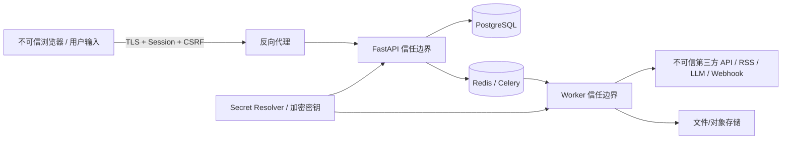

# Sports Intelligence OS 安全、权限、日志与审计设计

文档状态：Prompt 01 安全基线  
更新日期：2026-07-25

## 1. 安全目标

- 工作区之间数据隔离，任何资源访问都同时验证身份、成员关系和权限。
- 密码、会话、第三方 Token、Webhook URL 等秘密在传输、存储、日志和 UI 中受保护。
- 外部数据、Prompt 输入、上传文件和自定义 URL 一律视为不可信。
- 关键状态变更可追溯到 actor、时间、资源、原因和 trace。
- 失败默认安全：未验证连接不显示成功、缺失权限不降级、未知通知结果不盲目重发。

本设计不声明特定法规认证。部署者需按用户地区、新闻版权、个人数据和平台条款补充合规评估。

## 2. 信任边界与威胁模型

主要威胁：

| 威胁 | 例子 | 主要控制 |
| --- | --- | --- |
| 身份冒用 | 撞库、会话盗用 | Argon2id、限速、HttpOnly/Secure、轮换/撤销、登录审计 |
| 越权/租户逃逸 | 猜测其他工作区 UUID | workspace-scoped 仓储、RBAC、404 隐藏、跨租户测试 |
| CSRF/XSS | Cookie 被跨站利用、新闻正文注入 | CSRF token、SameSite、CSP、输出编码、HTML 清洗 |
| SSRF | 自定义 Webhook/兼容 API 请求内网 | URL 策略、DNS/IP 复核、端口/重定向/响应限制 |
| Prompt Injection | 新闻正文要求泄露系统 Prompt/Token | 内容-指令隔离、工具 allowlist、无秘密模型上下文 |
| 秘密泄露 | 日志打印 Token、API 回显密文 | Secret 类型、集中脱敏、响应 DTO allowlist、审计 |
| 供应链 | 恶意 npm/Python 依赖 | lockfile、最小依赖、漏洞/许可证扫描、镜像固定 |
| 重放/重复副作用 | 重复 Celery 任务发送多次通知 | Idempotency-Key、Inbox/Outbox、唯一约束、unknown 协调 |
| 资源耗尽 | 大文件、复杂正则、无限 LLM 重写 | 大小/复杂度/预算/尝试上限、队列隔离 |
| 数据真实性混淆 | Mock 冒充 YouTube、抓取时间冒充发布时间 | 来源强制字段、UI 标签、领域不变量、验收测试 |

## 3. 认证设计

### 3.1 密码

- 使用 Argon2id，参数在部署基准测试后选择并版本化；哈希字符串包含参数和 salt。
- 密码最低长度和常见泄露密码策略在 Prompt 02 明确；不采用阻碍密码管理器的复杂组合规则。
- 登录错误使用统一响应，避免枚举邮箱；按 IP 摘要 + 账号维度限速。
- 密码重置首期如未实现，必须在 UI/README 明确，不提供假按钮；管理员受控恢复写审计。

### 3.2 会话

首期采用同源、服务器可撤销的 opaque Session：

- 浏览器 Cookie：随机高熵 token，`HttpOnly`、生产 `Secure`、`SameSite=Lax`、限定 Path/Domain。
- 数据库只保存 token 的密码学哈希、过期和撤销状态；Cookie 原值不落日志。
- 登录成功轮换 Session；权限提升、密码更改和可疑活动撤销相关 Session。
- 绝对过期和空闲过期并存；`last_seen_at` 节流更新。
- 退出使服务端 Session 失效，而非只删除浏览器 Cookie。

不把访问 Token 存入 localStorage。若未来开放第三方 API 客户端，另行设计 OAuth2/OIDC，不复用浏览器 Session。

### 3.3 CSRF、CORS 与代理

- 所有状态变更请求要求与 Session 绑定的 CSRF token 和自定义 header；验证 Origin/Referer 作为补充。
- CORS 默认只允许配置的同源 Web；不使用 `*` + credentials。
- 只信任明确反向代理；对 `X-Forwarded-*` 使用可信代理列表，避免伪造来源/IP。
- 登录、秘密变更、测试通知、导出等高风险端点额外限速。

### 3.4 初始管理员

Prompt 02 提供一次性 CLI/bootstrap 命令，从安全交互或环境变量读取初始凭证。命令不可打印密码，不提供默认生产账号，成功后写审计并建议移除 bootstrap secret。

## 4. 授权模型

### 4.1 角色

- `owner`：工作区所有权、成员、集成和所有业务权限。
- `admin`：成员（不能移除最后 Owner）、集成、渠道和业务管理。
- `editor`：新闻整理、编辑规则/Prompt、生成和自动化草稿；发布权限按矩阵限制。
- `analyst`：读取数据、运行同步/生成/dry-run，不管理秘密或发布高影响配置。
- `viewer`：只读业务数据和允许的生成结果。

### 4.2 权限矩阵基线

| Permission | Owner | Admin | Editor | Analyst | Viewer |
| --- | :---: | :---: | :---: | :---: | :---: |
| `workspace:manage` | ✓ |  |  |  |  |
| `members:read` | ✓ | ✓ |  |  |  |
| `members:manage` | ✓ | ✓* |  |  |  |
| `integrations:read` | ✓ | ✓ |  |  |  |
| `integrations:manage` | ✓ | ✓ |  |  |  |
| `accounts:read` / `news:read` | ✓ | ✓ | ✓ | ✓ | ✓ |
| `accounts:manage` / `news:manage` | ✓ | ✓ | ✓ |  |  |
| `sync:run` | ✓ | ✓ | ✓ | ✓ |  |
| `editorial_rules:edit` / `prompts:edit` | ✓ | ✓ | ✓ |  |  |
| `editorial_rules:publish` / `prompts:publish` | ✓ | ✓ | ✓** |  |  |
| `generation:run` | ✓ | ✓ | ✓ | ✓ |  |
| `generation:content_read` | ✓ | ✓ | ✓ | ✓ | 按配置 |
| `automation:edit` | ✓ | ✓ | ✓ |  |  |
| `automation:publish` | ✓ | ✓ |  |  |  |
| `notifications:manage` | ✓ | ✓ |  |  |  |
| `audit:read` | ✓ | ✓ |  |  |  |

\* Admin 不能转移所有权或移除最后 Owner。  
\** 首期可配置 Editor 发布编辑内容规则；涉及通知/外部副作用的 Automation 发布只允许 Owner/Admin。

角色映射在服务端配置/代码中集中定义，权限名稳定。未来支持自定义角色时保存 permission 集合，不改变用例检查方式。

### 4.3 强制执行点

- FastAPI dependency 做粗粒度身份和 workspace Membership 检查。
- Application use case 做具体 permission 和资源归属检查。
- Repository 方法始终要求 workspace ID，避免授权后又按裸 ID 查询。
- Worker 从可信 TaskRun 加载 workspace 和 actor context，不相信队列载荷中的任意 workspace。
- UI 隐藏按钮仅改善体验，不是安全控制。

## 5. 秘密管理

### 5.1 分类

秘密包括平台 API key/OAuth token、LLM key、SMTP 密码、Webhook/机器人 URL 和签名 secret、Session/CSRF token、应用加密密钥。

### 5.2 首期存储

- 根加密密钥来自环境变量或 Docker Secret，不进入数据库/仓库/镜像。
- Provider secret 使用版本化 envelope encryption（推荐 AES-256-GCM 或成熟库）保存密文、nonce、key version；附加数据绑定 workspace、connection 和字段名。
- 应用只在调用前短暂解密到内存；Secret 值使用专用类型，默认 repr 为掩码。
- `.env.example` 只写变量名和安全说明，不写真实值。
- 支持密钥轮换：新写使用新版本，后台受控重加密旧值；轮换写审计。

若部署环境提供 Vault/云 Secret Manager，`SecretStore` 端口可保存外部 ref，领域模型不变。

### 5.3 OAuth

需要 OAuth 的 Provider 后续使用 state + PKCE、严格 redirect URI、最小 scope、加密 refresh token 和撤销流程。首期 YouTube 若使用 API key，只访问公开授权数据；若需要私有 Analytics 指标，必须明确 OAuth scope 与用户授权，不能通过 Cookie 抓取代替。

## 6. 数据保护与隐私

- 收集最少必要用户数据；邮箱规范化与展示值分开。
- IP 仅在安全需要时使用带轮换 salt 的哈希/前缀摘要，不长期保存完整值，除非部署政策要求。
- 新闻和平台公开数据仍受来源条款与版权约束；正文存储按许可配置。
- 上传件、完整 Prompt/生成内容按工作区权限访问，下载使用短期签名或经 API 授权流式返回。
- 导出默认排除秘密、内部错误、原始响应和不必要个人数据。
- 数据删除、保留和备份策略见数据库设计；删除操作写审计。

## 7. 外部调用安全

- 统一 HTTP 客户端设置 DNS/连接/读取/总 deadline、响应大小、受控重定向和 TLS 验证。
- 自定义 base URL、RSS URL、Webhook URL 均通过 SSRF 策略；阻止私网、loopback、link-local、metadata、非允许端口和协议。
- 不允许用户控制 Host、Authorization、Content-Length 等危险请求头。
- Playwright 仅用于合法公开页面，运行在隔离容器/低权限用户，无工作区秘密，无持久浏览器登录。
- Provider SDK 权限最小化，配额与错误日志不暴露请求正文/Token。

## 8. 上传安全

- 按内容嗅探验证 MIME，限制大小、数量、压缩展开比和文件名长度；存储对象键由系统生成。
- 文件名仅作为显示元数据，防止路径穿越；不直接在 Web 根目录提供。
- 对 Office/PDF/压缩包采用隔离提取流程；不执行宏、脚本或嵌入对象。
- 恶意文件扫描不可用时标记扫描状态，未通过文件不能进入生成工作流。
- 文本提取结果标来源和提取器版本，原文件哈希不可变。

## 9. Prompt/LLM 安全

- 外部内容与系统指令分层，明确标记引用边界；禁止把文章中的指令提升为系统消息。
- 工具由服务端注册和授权，模型不能选择任意 URL、SQL、Shell 或通知目标。
- 工具参数和结果均通过 schema、权限、SSRF 和大小限制。
- 不向模型发送 Provider Token、Session、无关工作区内容或完整审计日志。
- Provider 数据保留政策在连接 UI 显示；敏感内容发送前按工作区策略确认/脱敏。
- 模型输出始终视为不可信，进入 UI 前转义，进入 SSML/SRT/文件名前确定性校验。

## 10. 日志设计

### 10.1 结构化字段

统一 JSON 字段：`timestamp`、`level`、`service`、`environment`、`event`、`message`、`request_id`、`trace_id`、`correlation_id`、`workspace_id`、`actor_id`、`resource_type/id`、`provider_key`、`duration_ms`、`attempt`、`error_code`。

### 10.2 禁止记录

- Authorization/Cookie/CSRF、密码、Token、完整 Webhook URL、SMTP 凭证。
- 完整第三方请求/响应或完整用户上传、新闻正文、Prompt、生成结果（使用 ID、哈希和安全摘要）。
- 数据库连接串中的密码、异常对象中携带的 headers。

集中脱敏在日志处理器和 HTTP 客户端中完成，并有测试。开发环境也遵守，不以 debug 模式为由打印秘密。

### 10.3 日志级别

- INFO：命令接受、任务状态变化、Provider 调用摘要、发布/投递成功。
- WARNING：限流、重试、数据异常、Mock 在生产策略下被拒绝、冷却/去重抑制。
- ERROR：永久失败、契约映射错误、数据一致性/安全控制失败。
- 不为正常 4xx 打堆栈；未知 5xx 记录内部 error ID，响应只返回安全信息。

## 11. 审计设计

必须审计：

- 登录成功/失败摘要、退出、会话撤销和管理员恢复；
- 成员/角色和工作区设置变更；
- Connection/Channel 创建、秘密替换、验证、停用和删除；
- Editorial Rule、Prompt、Workflow、Automation Rule 的创建、发布、回滚和启停；
- 手动同步、真实通知测试、通知人工重试、生成采用/拒绝；
- 敏感原文/完整生成内容下载、导出、删除和密钥轮换。

AuditEntry 保存 actor、动作、资源、前后哈希/安全差异摘要、原因、时间和 trace。它不保存秘密，也不依赖普通应用日志。Audit API 只读、严格分页且要求 `audit:read`；普通用户无法修改/删除。

## 12. 系统事件与审计的区别

| 维度 | System Event | Audit Entry |
| --- | --- | --- |
| 目的 | 运营状态和故障排查 | 安全与责任追踪 |
| 内容 | 任务、Provider、同步、生成、通知状态 | 谁对敏感资源做了什么 |
| 可见权限 | 较广的运营读取 | Owner/Admin |
| 保留 | 默认 90 天可配置 | 默认至少 1 年或部署政策 |
| 可修改 | 状态可被确认/关闭 | 追加式，不普通更新/删除 |

## 13. 基础设施与供应链

- Docker 容器使用非 root 用户、只读根文件系统（可行处）、最小 capability、健康检查和资源限制。
- 镜像与依赖版本固定；Python/Node lockfile 纳入仓库；CI 执行依赖漏洞和 secret 扫描。
- PostgreSQL/Redis 不暴露公网；生产使用独立强凭证和网络隔离。
- 生产关闭 FastAPI debug/docs 的公开访问或加保护；错误不显示堆栈。
- 备份加密、定期恢复演练；恢复环境同样保护秘密与审计。

## 14. 安全测试门

- 密码哈希、Session 撤销/过期/固定攻击、CSRF、CORS 和登录限速。
- 每个工作区资源的 IDOR/越权矩阵；随机 UUID 不构成授权。
- API/日志/审计/导出不泄露秘密。
- SSRF：IPv4/IPv6、DNS 重绑定、重定向、编码地址、metadata 地址。
- XSS/HTML/Markdown、CSV 公式注入、路径穿越、上传炸弹。
- Prompt injection 不能获得秘密或调用未授权工具。
- 重复任务和超时未知结果不产生未受控副作用。
- Mock 数据不进入生产通知默认路径。

## 15. 安全响应

检测到疑似秘密泄露时：立即撤销/轮换秘密、停用相关 Connection/Channel、保留审计与必要日志、确认影响工作区和调用范围、通知管理员并记录事件。仓库中发现秘密时仅删除文件不足以解决问题，必须轮换并考虑历史清理。

首期提供管理员可见的安全事件；自动化封禁、SIEM、企业 SSO/MFA 和精细数据分级在后续按风险实现。
